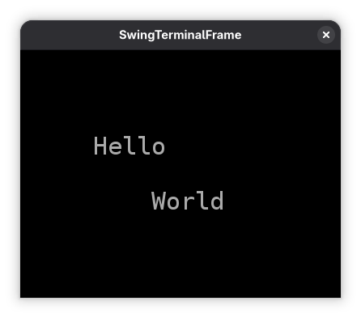
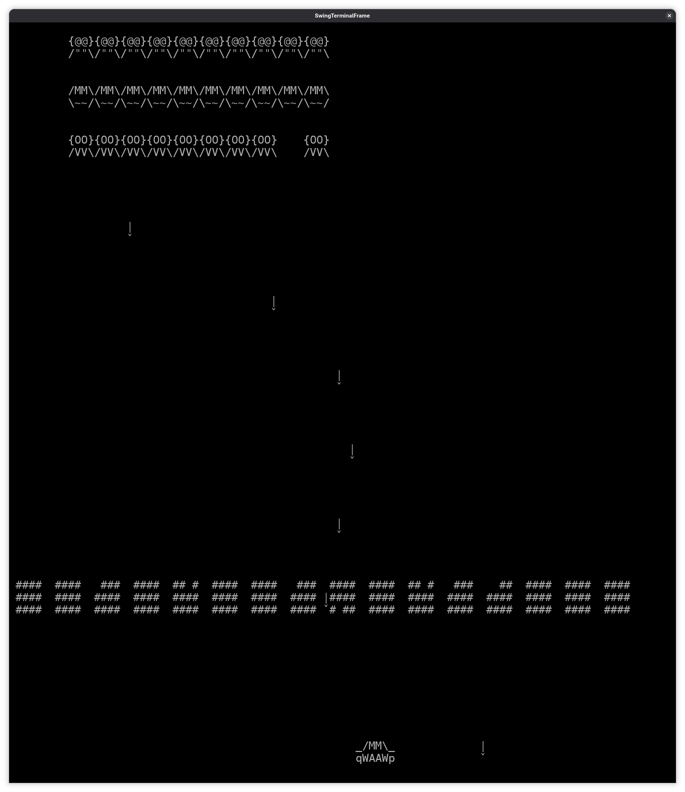
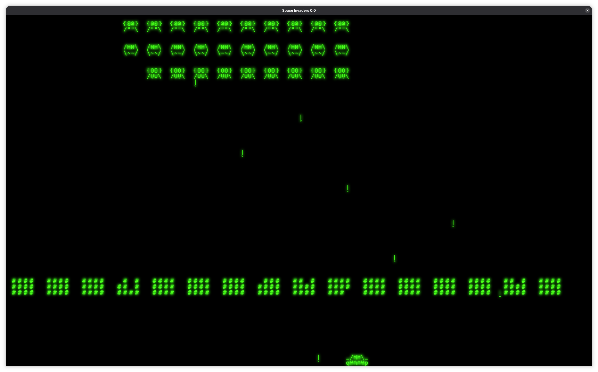

```{.java .cb-run}
import static java.lang.IO.println;
import java.util.Random;
import java.util.ArrayList;
import java.util.List;

public record V2(int x, int y) {

    V2 plus(V2 other) {
        return new V2(x + other.x(), y + other.y());
    }

}


public class Utils {

    public static <T> boolean intersect(List<T> xs, List<T> ys) {
        for (var x : xs) {
            if (ys.contains(x)) {
                return true;
            }
        }
        return false;
    }

    public static V2 charToV2(char dir) {
        return switch (dir) {
            case 'a' -> new V2(-1, 0);
            case 'd' -> new V2(1, 0);
            default -> new V2(0, 0);
        };
    }

    public static boolean isOnBoard(V2 v, int width, int height) {
        return v.x() >= 0 && v.x() < width && v.y() >= 0 && v.y() < height;
    }

    /**
     * Returns the x-coordinates of all points in the given list.
     * Useful for expressing "some x == value" as "xCoordinates.contains(value)".
     */
    public static List<Integer> getXCoordinates( List<V2>  xs) {
        var acc = new ArrayList<Integer>();
        for (var v : xs) {
            acc.add(v.x());
        }
        return acc;
    }

    public static List<Integer> getYCoordinates( List<V2>  xs) {
        var acc = new ArrayList<Integer>();
        for (var v : xs) {
            acc.add(v.y());
        }
        return acc;
    }

    public static boolean isOnBoard(List<V2> xs, int width, int height) {
        for (var v : xs) {
            if (isOnBoard(v, width, height)) {
                return true;
            }
        }
        return false;
    }

    public static <T> T random(List<T> xs) {
        if (xs.isEmpty()) return null;
        var random = new Random();
        var index = random.nextInt(xs.size());
        return xs.get(index);
    }

    public static String repeat(String s, int count){
        var acc = "";
        for (int i =0; i < count; i++){
            acc += s;
        }
        return acc;
    }

}

public record StringWithLocation(String string, V2 location) {
}

public record BasicGameObject(V2 pos, String displayString) {


    public  List<StringWithLocation> show(){
        var lines = displayString.lines().toList();
        var acc = new ArrayList<StringWithLocation>();
        for (int rowIndex = 0; rowIndex < lines.size(); rowIndex++) {
            acc.add(new StringWithLocation(lines.get(rowIndex), pos.plus(new V2(0, rowIndex))));
        }
        return acc;
    }

    public  List<V2> hitBox() {
        var acc = new ArrayList<V2>();
        for (var stringWithLocation : show()) {
            for (int colIndex = 0; colIndex < stringWithLocation.string().length(); colIndex++) {
                acc.add(stringWithLocation.location().plus(new V2(colIndex, 0)));
            }
        }
        return acc;
    }
}

public record MovableGameObject(BasicGameObject basicGameObject){

    public MovableGameObject(V2 pos, String displayString) {
        this(new BasicGameObject(pos,displayString));
    }

    public V2 pos() {
        return basicGameObject.pos();
    }

    public MovableGameObject move(V2 dir){
        return new MovableGameObject(pos().plus(dir), basicGameObject.displayString());
    }


    public List<StringWithLocation> show() {
        return basicGameObject().show();
    }

    public List<V2> hitBox() {
        return basicGameObject.hitBox();
    }


    boolean touchesLeftBorder() {
        // hitbox touches x == 0
        return Utils.getXCoordinates(hitBox()).contains(0);
    }

    boolean touchesRightBorder(int width) {
        // hitbox touches the rightmost valid x coordinate
        return Utils.getXCoordinates(hitBox()).contains(width -1); }
}

public record PlayerRocket(MovableGameObject mgo) {

    PlayerRocket(V2 pos){
        this(new MovableGameObject(pos,"|\n^"));
    }

    public V2 pos() {
        return mgo.pos();
    }

    public List<StringWithLocation> show() {
        return mgo.show();
    }

    public List<V2> hitBox() {
        return mgo.hitBox();
    }

    public PlayerRocket move() {
        return new PlayerRocket(mgo.move(new V2(0,-1)));
    }

    public boolean isPlayerRocket() {
        return true;
    }


}


public record AlienRocket(MovableGameObject mgo) {

    AlienRocket(V2 pos){
        this(new MovableGameObject(pos,"|\nˇ"));
    }

    public V2 pos() {
        return mgo.pos();
    }

    public List<StringWithLocation> show() {
        return mgo.show();
    }

    public List<V2> hitBox() {
        return mgo.hitBox();
    }


    public boolean isPlayerRocket() {
        return false;
    }

    public AlienRocket move() {
        return new AlienRocket(mgo.move(new V2(0,1)));
    }


}

public record Player(MovableGameObject mgo) {

    Player(V2 pos){
        this(new MovableGameObject(pos, "_/MM\\_\nqWAAWp"));
    }

    public V2 pos() {
        return mgo.pos();
    }

    public List<StringWithLocation> show() {
        return mgo.show();
    }


    public List<V2> hitBox() {
        return mgo.hitBox();
    }

    public Player move(V2 dir) {
        return new Player(mgo().move(dir));
    }

    public Player reactToBorder(int width) {
       if (mgo.touchesRightBorder(width))
           return  move(new V2(-1, 0));
       else if (mgo.touchesLeftBorder())
           return move(new V2(1, 0));
       else
           return this;
    }

    public Player moveBounded(V2 dir, int width) {
        return move(dir).reactToBorder(width);
    }

    public PlayerRocket shoot() {
        return new PlayerRocket(pos().plus(new V2(0,-2)));
    }


}


public record Alien(MovableGameObject mgo) {


    Alien(V2 pos, String displayString){
        this(new MovableGameObject(pos, displayString));
    }

    public Alien move(V2 dir) {
        return new Alien(mgo.move(dir));
    }


    public List<StringWithLocation> show() {
        return mgo.show();
    }


    public List<V2> hitBox() {
        return mgo.hitBox();
    }

    public V2 pos() {
        return mgo.pos();
    }

    public AlienRocket shoot() {
        return new AlienRocket(pos().plus(new V2(0,2)));
    }


    boolean touchesLeftBorder() {
        return mgo.touchesLeftBorder();
    }

    boolean touchesRightBorder(int width) {
        return mgo.touchesRightBorder(width);
    }

    


    //Returns true if any part of this alien's hitbox reaches the last playable line.
    boolean isInLastLine(int height) {
        int lastPossibleLine = height - 1;
        return Utils.getYCoordinates(hitBox()).contains(lastPossibleLine);
    }


}


public record CountDown(int start,
    int current){

    public CountDown(int start) {
        this(start, start);
    }


    public CountDown countDown(){
        if (current > 0) {
            return new CountDown(start, current -1);
        }
        else {
            return new CountDown(start);
        }

    }

    public boolean finished(){
        return this.current == 0;
    }
}


public record AlienSwarm(
        V2 aliensDirection,
        List<Alien> aliens,
        CountDown alienRocketCountdown
) {


    public static String rowToAlienStrings(int i){
        return switch (i){
            case 2 -> "{@@}\n/\"\"\\" ;
            case 1 -> "/MM\\\n\\~~/";
            case 0 -> "{OO}\n/VV\\";
            default -> throw new IllegalStateException("Unexpected value: " + i);
        };

    }

    public static  List<Alien>createAliens (){
        var res = new ArrayList<Alien>();
        for (int row = 0; row < 3; row++) {
            for (int col = 0; col < 10; col++) {
                var x = 36 - col* 4;
                var y = 8 - row * 4;
                var pos = new V2(x, y);
                res.add(new Alien(pos, rowToAlienStrings(row)));

            }
        }return res;
    }

    AlienSwarm() {
        this(new V2(1, 0), createAliens(), new CountDown(5));
    }

    public boolean noAliensLeft() {
        return aliens.isEmpty();
    }


    public boolean aliensAreInLastLine(int height) {
        for (var alien : aliens) {
            if (alien.isInLastLine(height)) {
                return true;
            }
        }
        return false;
    }


    public AlienSwarm move(){
        var res = new ArrayList<Alien>();
        for (var mgo : aliens) {
            res.add(mgo.move(aliensDirection));
        }
        return new AlienSwarm(aliensDirection, res, alienRocketCountdown.countDown());
    }

    public boolean touchesLeftBorder() {
        for (var alien : aliens) {
            if (alien.touchesLeftBorder()) {
                return true;
            }
        }
        return false;
    }

    public boolean touchesRightBorder(int width) {
        for (var alien : aliens) {
            if (alien.touchesRightBorder(width)) {
                return true;
            }
        }
        return false;
    }


        public V2 computeNextAlienDirection(int width) {
            boolean movingRight = aliensDirection.equals(new V2(1, 0));
            boolean movingLeft  = aliensDirection.equals(new V2(-1, 0));
            boolean movingDown  = aliensDirection.equals(new V2(0, 1));

            boolean atRightBorder = touchesRightBorder(width);
            boolean atLeftBorder  = touchesLeftBorder();

            // When moving horizontally and touching a side, start moving down
            if ((movingRight && atRightBorder) || (movingLeft && atLeftBorder)) {
                return new V2(0, 1);
            }

            // When moving down on the right side, start moving left
            if (movingDown && atRightBorder) {
                return new V2(-1, 0);
            }

            // When moving down on the left side, start moving right
            if (movingDown && atLeftBorder) {
                return new V2(1, 0);
            }

            return aliensDirection;
        }

    public AlienSwarm reactToBorder(int width){
        return new AlienSwarm(computeNextAlienDirection(width), aliens,alienRocketCountdown);
    }

    public AlienSwarm moveBounded(int width) {
        return move().reactToBorder(width);
    }

    public boolean countDownFinished() {
        return alienRocketCountdown.finished();
    }

    /**
     * Returns all aliens in the lowest row.
     * <p>
     * Invariant: aliens are ordered so that all aliens in the lowest row
     * come first in the list. Therefore, we can look only at the first element's y.
     */
    List<Alien> getLowestAliens() {
        if (aliens.isEmpty()) return List.of();
        int lowestLine = aliens.getFirst().pos().y();
        var acc = new ArrayList<Alien>();
        for (var alien : aliens) {
            if (alien.pos().y() == lowestLine) {
                acc.add(alien);
            }
        }
        return acc;
    }

    public Alien getShootingAlien() {
        if (countDownFinished()){
            return Utils.random(getLowestAliens());}
        return null;
    }

}


public class LevelFactory {
    public static List<BasicGameObject> generateBlock(V2 pos, int cols, int rows) {
        var acc = new ArrayList<BasicGameObject>();
        for (int y = 0; y < rows; y++) {
            for (int x = 0; x < cols; x++) {
                acc.add(new BasicGameObject(pos.plus(new V2(x, y)), "#"));
            }
        }
        return acc;
    }

    public static List<BasicGameObject> generateBlocks(V2 startPos, int cols, int rows, int count) {
        var acc = new ArrayList<BasicGameObject>();
        var pos = startPos;
        for (int i = 0; i < count; i++) {
            acc.addAll(generateBlock(pos, cols, rows));
            pos = pos.plus(new V2(cols + 2, 0));
        }
        return acc;
    }

    public static List<BasicGameObject> generateBlocks(int width, int height) {
        int blockCols = 4;
        int blockGap = 2;
        int blockRows = 3;
        int blockCount = width / (blockCols + blockGap);
        return generateBlocks(new V2(1, 3 * height / 4), blockCols, blockRows, blockCount);
    }


}


public record Plasma(MovableGameObject mgo) {


    Plasma(V2 pos, int height){


        String rocket =  Utils.repeat("(((||||||||||)))\n", height);


        var mgo = new MovableGameObject(pos,rocket); // "/|\\\n|||\n|||\n|||\n|||"));
        this(mgo);
    }

    public V2 pos() {
        return mgo.pos();
    }

    public Plasma move() {
        return new Plasma((mgo.move(new V2(0,-3))));
    }

    public boolean isPlayerRocket() {
        return true;
    }


    public List<StringWithLocation> show() {
        return mgo.show();
    }

    public List<V2> hitBox() {
        return mgo.hitBox();
    }

}

public record InvisiblePlasmaCannon(V2 pos){
    public Plasma shoot() {
        var plasmaHeight =  pos.y();
        return new Plasma(  pos().plus(new V2(0,-plasmaHeight)), plasmaHeight);
    }
}


public class Model {
    public final int width;
    public final int height;
    public Player player;
    public AlienSwarm alienSwarm;
    public List<BasicGameObject> blocks;

    public void restart() {
        this.player = new Player(new V2(width /2, height -2));
        this.alienSwarm = new AlienSwarm();
        this.blocks = LevelFactory.generateBlocks(new V2(1, 3 * height /4),4,3, width /6 );
    }

    public Model(int width, int height) {
        this.width = width;
        this.height = height;
        restart();
    }

    public Model(int width, int height, V2 playerPos, List<Alien> alienSwarm, List<BasicGameObject> blocks) {
        this.width = width;
        this.height = height;
        this.player =new Player(playerPos);
        this.alienSwarm = new AlienSwarm(new V2(1,0), alienSwarm, new CountDown(5));
        this.blocks = blocks;
    }


    public boolean gameWon(){
        return alienSwarm.noAliensLeft();
    }

    public String getEndMessage(){
        if (gameWon()){
            return "You won!";
        }
        return "You lost!";
    }

    public void move(char dir){

        alienSwarm = alienSwarm.moveBounded(width);
        player = player.moveBounded(Utils.charToV2(dir),width);
    }

    public void update(char key){
        move(key);
    }


}


```

Definiere jede Klasse in einer eigenen Datei. Der Name der Datei soll immer der Name der Klasse sein.

# V2

## Aufgabe

Erstelle ein Record `V2`{.java}. Die Objekte dieser Klasse sind Vektoren im zweidimensionalen Raum mit ganzzahligen Komponenten.

```{.java .cb-nb line_numbers=false}
new V2(3, 2);
```
```{.java .cb-nb line_numbers=false}
new V2(1, -5);
```


## Aufgabe
Erweitere die Klasse `V2`{.java} um die Methode `plus`{.java}. Der Methode wird ein Vektor übergeben. Es wird die Summe der beiden Vektoren zurückgegeben.


```{.java .cb-nb line_numbers=false}
new V2(3, 2).plus(new V2(1, -5));
```
```{.java .cb-nb line_numbers=false}
new V2(3, 4).plus(new V2(-4, -5));
```
**Hinweis:**
 
$$\begin{pmatrix} v_{1} \\ v_{2}\end{pmatrix} +  \begin{pmatrix} w_{1} \\ w_{2} \end{pmatrix} = \begin{pmatrix}  v_{1} + w_{1} \\ v_{2} + w_{2} \end{pmatrix}$$


# Utils

## Aufgabe

Lege die Klasse `Utils` in `Utils.java` an. Alle Methoden dieser Klasse sind statisch.


## Aufgabe

Implementiere eine Methode `getXCoordinates`{.java}. Der Methode wird eine `Liste` von `V2` übergeben. Sie gibt eine Liste aller `x`\-Koordinaten zurück.

```{.java .cb-nb line_numbers=false}
Utils.getXCoordinates(List.of(new V2(3, 4), new V2(7, 9), new V2(3, 5)));
```

```{.java .cb-nb line_numbers=false}
Utils.getXCoordinates(List.of(new V2(-1, 2)));
```


## Aufgabe

Implementiere eine Methode `getYCoordinates`{.java}. Der Methode wird eine `Liste` von `V2` übergeben. Sie gibt eine Liste aller `y`\-Koordinaten zurück.

```{.java .cb-nb line_numbers=false}
Utils.getYCoordinates(List.of(new V2(3, 4), new V2(7, 9), new V2(3, 5)));
```

```{.java .cb-nb line_numbers=false}
Utils.getYCoordinates(List.of(new V2(5, 2), new V2(-2, 9)));
```


## Aufgabe

Implementiere eine Methode `isOnBoard`{.java} für eine einzelne Zelle. Der Methode werden

- eine Zelle als `V2`,
- die Anzahl der Spalten des Spielfelds und
- die Anzahl der Zeilen des Spielfelds

übergeben. Sie gibt zurück, ob die Zelle auf dem Spielfeld ist. Das ist nur der Fall, wenn

- Keine Koordinate negativ ist und
- Die `x`-Koordinate echt kleiner ist als die Anzahl der Spalten und
- Die `y`-Koordinate echt kleiner ist als die Anzahl der Zeilen.

```{.java .cb-nb line_numbers=false}
Utils.isOnBoard(new V2(3, 4), 10, 8);
```

```{.java .cb-nb line_numbers=false}
Utils.isOnBoard(new V2(-1, 0), 10, 8);
```

```{.java .cb-nb line_numbers=false}
Utils.isOnBoard(new V2(9, 7), 10, 8);
```


## Aufgabe

Implementiere eine Methode `isOnBoard`{.java} für eine Hitbox. Der Methode werden

- eine `List<V2>` (die Hitbox),
- die Anzahl der Spalten des Spielfelds und
- die Anzahl der Zeilen des Spielfelds

übergeben. Sie gibt `true` zurück, wenn mindestens eine der Zellen in der Liste auf dem Spielfeld liegt.

```{.java .cb-nb line_numbers=false}
Utils.isOnBoard(List.of(new V2(9,7), new V2(10, 7)), 10, 8);
```
```{.java .cb-nb line_numbers=false}
Utils.isOnBoard(List.of(new V2(-1,7), new V2(0, 7)), 10, 8);
```
```{.java .cb-nb line_numbers=false}
Utils.isOnBoard(List.of(new V2(11,7), new V2(10, 7)), 10, 8);
```

**Hinweis:** Nutze die vorherige `isOnBoard`\-Variante für einzelne Zellen.


## Aufgabe

Implementiere eine Methode `intersect`{.java}. Der Methode werden zwei Listen vom selben Typ übergeben. Sie gibt `true` zurück, wenn es mindestens ein gemeinsames Element gibt, sonst `false`.

```{.java .cb-nb line_numbers=false}
Utils.intersect(List.of(1, 2), List.of(2, 3, 4));
```

```{.java .cb-nb line_numbers=false}
Utils.intersect(List.of(new V2(1, 1)),
                List.of(new V2(1, 5)));
```

**Hinweis:** Nutze `contains`!.


## Hinweis


Importiere mit
```java
import java.util.Random;
```

die Klasse `Random`! Diese hat eine Methode `nextInt`. Der Methode wird ein Integer $n$ übergeben. Sie gibt einen zufälligen Integer zurück, der echt kleiner als $n$ ist.


```{.java .cb-nb line_numbers=false}
var r = new Random();
r.nextInt(5)
```
```{.java .cb-nb line_numbers=false}
r.nextInt(5)
```

## Aufgabe

Implementiere eine statische Methode `random`{.java}.  
Der Methode wird eine beliebige Liste übergeben. Die Methode gibt **ein zufälliges Element** aus der Liste zurück.

- Ist die Liste **leer**, soll `null` zurückgegeben werden.
- Andernfalls soll **genau ein Element** der Liste zufällig ausgewählt werden.

```{.java .cb-nb line_numbers=false}
Utils.random(List.of(1, 2, 3));
```

```{.java .cb-nb line_numbers=false}
Utils.random(List.of("a", "b", "c"));
```

```{.java .cb-nb line_numbers=false}
Utils.random(List.of());
```


## Aufgabe

Implementiere eine statische Methode `charToV2`{.java}.  
Der Methode wird ein Zeichen (`char`) übergeben. Die Methode gibt einen Richtungsvektor vom Typ `V2` zurück.

Die Zuordnung ist:

- `'a'` → Bewegung nach links
- `'d'` → Bewegung nach rechts
- jedes andere Zeichen → keine Bewegung 

```{.java .cb-nb line_numbers=false}
Utils.charToV2('a');
```

```{.java .cb-nb line_numbers=false}
Utils.charToV2('d');
```

```{.java .cb-nb line_numbers=false}
Utils.charToV2('x');
```

# StringWithLocation


## Aufgabe

Erstelle ein Record `StringWithLocation`.
Die Eigenschaften sind

- `string` mit dem Typ `String`
- `location` mit dem Typ `V2`

```{.java .cb-nb line_numbers=false}
new StringWithLocation("Hi", new V2(3, 4));
```
```{.java .cb-nb line_numbers=false}
new StringWithLocation("bye", new V2(5, 7));
```

# BasicGameObject

## Aufgabe

Erstelle ein `record` `BasicGameObject`! 
Die Eigenschaften sind

- `pos` mit dem Typ `V2`
-  `displayString` mit dem Typ `String`

```{.java .cb-nb line_numbers=false}
new BasicGameObject(new V2(3, 4), "xy");
```

```{.java .cb-nb line_numbers=false}
new BasicGameObject(new V2(10, 5), "abc\ndef");
```


## Hinweis

Du kannst die Methoden `lines` und `toList` nutzen, um einen String an den Zeilenumbrüchen (`\n`) aufzuteilen.

```{.java .cb-nb line_numbers=false}
"abc\ndef\nghi".lines().toList()
```

## Aufgabe

Erweitere `BasicGameObject` um eine Methode `show`{.java}.  
Sie gibt eine `List<StringWithLocation>` zurück.  
Jede Zeile des `displayString` wird in ein `StringWithLocation` umgewandelt.  
Die erste Zeile beginnt an der Position des Objekts.  Jede weitere Zeile ist eine Zeile weiter unten.

\tiny

```{.java .cb-nb line_numbers=false}
var bgo1 = new BasicGameObject(new V2(3, 4), "xy");
bgo1.show();
```


```{.java .cb-nb line_numbers=false}
var bgo2 = new BasicGameObject(new V2(10, 5), "abc\ndef");
bgo2.show();
```

\normalsize


## Aufgabe

Erweitere `BasicGameObject` um eine Methode `hitBox`{.java}.  
Sie gibt eine `List<V2>` zurück, die alle Zellen enthält, auf denen das Objekt gezeichnet wird.  
Jedes Zeichen des `displayString` (Zeile für Zeile) belegt genau eine Zelle.

\tiny

```{.java .cb-nb line_numbers=false}
var bgo1 = new BasicGameObject(new V2(3, 4), "xy");
bgo1.hitBox();
```

```{.java .cb-nb line_numbers=false}
var bgo2 = new BasicGameObject(new V2(10, 5), "abc\ndef");
bgo2.hitBox();
```

\normalsize


# MovableGameObject


## Aufgabe

Lege das `record` `MovableGameObject` an. Die einzige Eigenschaft hat den Typ `BasicGameObject`.

```{.java .cb-nb line_numbers=false}
var bgo = new BasicGameObject(new V2(3, 4), "xy");
var mgo = new MovableGameObject(bgo);
mgo;
```

## Aufgabe

Schreibe einen zusätzlichen Konstruktor für `MovableGameObject`{.java}. Dem Konstruktor werden eine Position als `V2` und der `displayString` übergeben. Er erzeugt intern ein `BasicGameObject` mit diesen Werten.

```{.java .cb-nb line_numbers=false}
new MovableGameObject(new V2(3, 4), "xy");
```
```{.java .cb-nb line_numbers=false}
new MovableGameObject(new V2(10, 5), "abc\ndef");
```


\vskip 10 pt

**Hinweis:** Die folgenden $3$ Methoden sind nur dazu da um die Methoden der Klasse `BasicGameObject` auch mit einem Objekt der Klasse `MovableGameObject` nutzen zu können. Die Implementierung besteht immer nur aus einer Zeile, in der die entsprechende Methode der Klasse `BasicGameObject` aufgerufen wird.


## Aufgabe

Erweitere  `MovableGameObject` um eine Methode `pos`{.java}. Sie gibt die Position des gekapselten `BasicGameObject` zurück.

```{.java .cb-nb line_numbers=false}
var mgo1 = new MovableGameObject(new V2(3, 4), "xy");
mgo1.pos();
```

## Aufgabe

Erweitere  `MovableGameObject` um eine Methode `show`{.java}! 
\tiny
```{.java .cb-nb line_numbers=false}
var mgo2 = new MovableGameObject(new V2(10, 5), "abc\ndef");
mgo2.show();
```
\normalsize

## Aufgabe

Erweitere  `MovableGameObject` um eine Methode `hitBox`{.java}. 
\tiny

```{.java .cb-nb line_numbers=false}
var mgo2 = new MovableGameObject(new V2(10, 5), "abc\ndef");
mgo2.hitBox();
```
\normalsize


## Aufgabe

Erweitere `MovableGameObject` um eine Methode `move`{.java}. Der Methode wird ein Vektor übergeben, mit dem das Objekt verschoben werden soll. Sie gibt das `MovableGameObject` mit verschobener Position zurück.

```{.java .cb-nb line_numbers=false}
var mgo1 = new MovableGameObject(new V2(3, 4), "xy");
mgo1.move(new V2(2, 1));
```

**Hinweis:** Nutze die Vektoraddition! 


## Aufgabe

Erweitere  `MovableGameObject` um eine Methode  `touchesLeftBorder`{.java}. Sie gibt zurück, ob eine Zelle der Hitbox die $x$-Koordinate $0$ hat.

```{.java .cb-nb line_numbers=false}
var mgo1 = new MovableGameObject(new V2(0, 4), "xy");
mgo1.touchesLeftBorder();
```
```{.java .cb-nb line_numbers=false}
var mgo2 = new MovableGameObject(new V2(10, 5), "abc\ndef");
mgo2.touchesLeftBorder();
```

**Hinweis:** Nutze `getXCoordinates`, `hitBox` und `contains`!

## Aufgabe

Erweitere `MovableGameObject` um eine Methode `touchesRightBorder`{.java}. Der Methode wird die Anzahl der Spalten des Spielfelds übergeben. Sie gibt zurück, ob eine Zelle der Hitbox in der letzten Spalte ist (`width - 1`).

```{.java .cb-nb line_numbers=false}
var mgo1 = new MovableGameObject(new V2(0, 4), "xy");
mgo1.touchesRightBorder(5);
```
```{.java .cb-nb line_numbers=false}
var mgo1 = new MovableGameObject(new V2(0, 4), "xy");
mgo1.touchesRightBorder(6);
```

**Hinweis:** Nutze `getXCoordinates`, `hitBox` und `contains`!


# PlayerRocket


## Aufgabe

Definiere ein `record` `PlayerRocket`. Die einzige Eigenschaft hat den Typ `MovableGameObject`. 

\tiny
```{.java .cb-nb line_numbers=false}
var mgo = new MovableGameObject(new V2(5, 10), "abc\ndef");
var pr = new PlayerRocket(mgo);
pr;
```
\normalsize

## Aufgabe

Implementiere einen zusätzlichen Konstruktor. Dem Konstruktor wird eine Position als `V2` übergeben. Er soll intern ein neues `MovableGameObject` mit dieser Position und dem Display-String `|\n^` erzeugen.

\tiny
```{.java .cb-nb line_numbers=false}
new PlayerRocket(new V2(10, 5));
```

## Aufgabe

Implementiere die Methode `isPlayerRocket`. Die Methode gibt immer `true` zurück!


```{.java .cb-nb line_numbers=false}
var pr = new PlayerRocket(new V2(10, 5));
pr.isPlayerRocket();
```


\normalsize
**Hinweis:** Die folgenden $4$ Methoden sind nur dazu da um die Methoden der Klasse `MovableGameObject` auch mit einem Objekt der Klasse `PlayerRocket` nutzen zu können. Die Implementierung besteht immer nur aus einer Zeile, in der die entsprechende Methode der Klasse `MovableGameObject` aufgerufen wird.


## Aufgabe

Implementiere die Methode `pos`. Diese gibt die Position als `V2` zurück!


```{.java .cb-nb line_numbers=false}
var pr = new PlayerRocket(new V2(10, 5));
pr.pos();
```

## Aufgabe

Implementiere die Methode `show`. 

\tiny
```{.java .cb-nb line_numbers=false}
var pr = new PlayerRocket(new V2(10, 5));
pr.show();
```
\normalsize

## Aufgabe

Implementiere die Methode `hitBox`.


```{.java .cb-nb line_numbers=false}
var pr = new PlayerRocket(new V2(10, 5));
```

## Aufgabe

Implementiere die Methode `move` so, dass sie eine um eine Zeile nach oben verschobene `PlayerRocket` zurückgibt.

\tiny
```{.java .cb-nb line_numbers=false}
var pr = new PlayerRocket(new V2(10, 5));
pr.move();
```
\normalsize


# AlienRocket

## Aufgabe 
Erstelle ein `record`  `AlienRocket`. Die einzige Eigenschaft hat den Typ `MovableGameObject`!

\tiny
```{.java .cb-nb line_numbers=false}
var mgo = new MovableGameObject(new V2(3, 4), "xy");
new AlienRocket(mgo);
```
\normalsize


## Aufgabe 
Implementiere einen Konstruktor für `AlienRocket`, dem nur eine Position als `V2` übergeben wird. Er soll intern ein `MovableGameObject` mit der übergebenen Position und dem String `"|\nˇ"` anlegen.

\tiny
```{.java .cb-nb line_numbers=false}
new AlienRocket(new V2(3, 4));
```
\normalsize

## Aufgabe 
Implementiere die Methode `isPlayerRocket`. Die Methode gibt immer `false` zurück.

```{.java .cb-nb line_numbers=false}
var ar =  new AlienRocket(new V2(3, 4));
ar.isPlayerRocket();
```


**Hinweis:** Die folgenden $3$ Methoden sind nur dazu da um die Methoden der Klasse `MovableGameObject` auch mit einem Objekt der Klasse `AlienRocket` nutzen zu können. Die Implementierung besteht immer nur aus einer Zeile, in der die entsprechende Methode der Klasse `MovableGameObject` aufgerufen wird.

## Aufgabe 
Implementiere die Methode `pos`. Diese gibt die Position zurück.

```{.java .cb-nb line_numbers=false}
var ar =  new AlienRocket(new V2(3, 4));
ar.pos();
```

## Aufgabe 
Implementiere die Methode `show()`!

\tiny
```{.java .cb-nb line_numbers=false}
var ar =  new AlienRocket(new V2(3, 4));
ar.show();
```
\normalsize


## Aufgabe 
Implementiere die Methode `hitBox`!

```{.java .cb-nb line_numbers=false}
var ar =  new AlienRocket(new V2(3, 4));
ar.hitBox();
```


## Aufgabe 
Implementiere die Methode `move`. Diese gibt eine um eine Zeile nach unten verschobene `AlienRocket` zurück.

\tiny
```{.java .cb-nb line_numbers=false}
AlienRocket ar = new AlienRocket(new V2(3,4));
ar.move(); 
```
\normalsize


# Player

## Aufgabe 
Erstelle ein `record` `Player`. Die einzige Eigenschaft hat den Typ `MovableGameObject`!

\tiny
```{.java .cb-nb line_numbers=false}
new Player(new MovableGameObject(new V2(3,2), "xy"));
```
\normalsize

## Aufgabe

Implementiere einen zusätzlichen Konstruktor. Dem Konstruktor wird eine Position als `V2` übergeben. Er soll intern ein neues `MovableGameObject` mit dieser Position und dem Display-String `"_\/MM\_\nqWAAWp"` erzeugen und setzen.

\tiny

```{.java .cb-nb line_numbers=false}
new Player(new V2(10, 50));
```
\normalsize

**Hinweis:** Die folgenden 4 Methoden sind nur dazu da um die Methoden der Klasse `MovableGameObject` auch mit einem Objekt der Klasse `Player` nutzen zu können. Die Implementierung besteht immer nur aus einer Zeile, in der die entsprechende Methode der Klasse `Player` aufgerufen wird.


## Aufgabe

Implementiere die Methode `pos`. Diese gibt die Position zurück!


```{.java .cb-nb line_numbers=false}
var player = new Player(new V2(10,5));
player.pos();
```

## Aufgabe

Implementiere die Methode `show`. 


\tiny
```{.java .cb-nb line_numbers=false}
var player = new Player(new V2(10,5));
player.show();
```
\normalsize

## Aufgabe

Implementiere die Methode `hitBox`. 

\tiny
```{.java .cb-nb line_numbers=false}
var player = new Player(new V2(10,5));
player.hitBox();
```
\normalsize

## Aufgabe

Implementiere die Methode `move(V2 dir)`! Diese gibt ein neues Objekt vom Typ `Player` zurück. Dieses wird mit dem übergebenen Vektor verschoben!


\tiny
```{.java .cb-nb line_numbers=false}
var player = new Player(new V2(10,5));
player.move(new V2(1,0));
```
\normalsize


## Aufgabe

Implementiere die  Methode `reactToBorder`. Der Methode wird die Breite des Spielfelds übergeben. Sie gibt ein neues Objekt vom Typ `Player` zurück. Wenn das Objekt rechts von der rechten Grenze ist, wird es um eine Einheit nach links verschoben.

\tiny
```{.java .cb-nb line_numbers=false}
var player = new Player(new V2(10,5));
player.reactToBorder(10);
```
\normalsize
Wenn das Objekt links von der linken Grenze ist, wird es um eine Einheit nach rechts verschoben.
\tiny

```{.java .cb-nb line_numbers=false}
var player = new Player(new V2(-1,5));
player.reactToBorder(10);
```
\normalsize

Ansonsten wird die Position unverändert zurückgegeben.
\tiny
```{.java .cb-nb line_numbers=false}
var player = new Player(new V2(3,5));
player.reactToBorder(10);
```
\normalsize

**Hinweis:** Nutze die Methoden `touchesLeftBorder` und `touchesRightBorder` der Klasse `MovableGameObject`!

## Aufgabe

Implementiere die Methode `moveBounded(V2 dir, int width)` so, dass sie ein Objekt vom Typ `Player` zurückgibt.
Sie bewegt das Objekt um den Vektor `dir` und passt es anschließend mit `reactToBorder` an die Breite `width` an!


\tiny
```{.java .cb-nb line_numbers=false}
new Player(new V2(10,5)).moveBounded(new V2(1,0), 10);
```
\normalsize

**Hinweis:** Nutze `move` und `reactToBorder`!

## Aufgabe

Implementiere die Methode `shoot`. Diese erzeugt ein neues `PlayerRocket` und gibt es zurück. Es befindet sich zwei Zeilen über dem `Player`-Objekt.


\tiny
```{.java .cb-nb line_numbers=false}
new Player(new V2(10,5)).shoot();
```
\normalsize


# Alien

## Aufgabe

Lege das `record` `Alien` an. Die einzige Eigenschaft hat den Typ `MovableGameObject`.

\tiny

```{.java .cb-nb line_numbers=false}
var mgo = new MovableGameObject(new V2(20, 4), "abc\ndef");
var alien = new Alien(mgo);
```
\normalsize


## Aufgabe
Schreibe einen Konstruktor. Dem Konstruktor werden eine Position als `V2` und der `displayString` übergeben. Er erzeugt intern ein `MovableGameObject` mit diesen Werten.

\tiny

```{.java .cb-nb line_numbers=false}
new Alien(new V2(20, 4), "abc\ndef");
```

\normalsize


**Hinweis:** Die folgenden Methoden sind nur dazu da um die Methoden der Klasse `MovableGameObject` auch mit einem Objekt der Klasse `Alien` nutzen zu können. Die Implementierung besteht immer nur aus einer Zeile, in der die entsprechende Methode der Klasse `BasicGameObject` aufgerufen wird.

## Aufgabe

Erweitere die Klasse `Alien` um die Methoden `pos`{.java}, `show`{.java} und `hitBox`{.java}. Rufe jeweils die entsprechenden Methoden von `MovableGameObject` auf!

\tiny
```{.java .cb-nb line_numbers=false}
var alien = new Alien(new V2(5, 6), "abc\ndef");
alien.pos();
```
```{.java .cb-nb line_numbers=false}
alien.show();
```
```{.java .cb-nb line_numbers=false}
alien.hitBox();
```
\normalsize

## Aufgabe

Erweitere `Alien` um eine Methode `move`{.java}. Der Methode wird ein Vektor übergeben, mit dem das Objekt verschoben werden soll. Sie gibt das `Alien` mit verschobener Position zurück.
\tiny
```{.java .cb-nb line_numbers=false}
var alien = new Alien(new V2(5, 6), "abc\ndef");
alien.move(new V2(1, 0));
```
```{.java .cb-nb line_numbers=false}
alien.move(new V2(-1, 0));
```
\normalsize


## Aufgabe

Erweitere  `Alien` um die Methoden `touchesLeftBorder`{.java} und `touchesRightBorder(int width)`{.java}. Beide Methoden rufen die entsprechenden Methoden der Klasse  `MovableGameObject` auf.

```{.java .cb-nb line_numbers=false}
var alien = new Alien(new V2(5, 6), "abc\ndef");
alien.touchesLeftBorder();
```
```{.java .cb-nb line_numbers=false}
var alien = new Alien(new V2(0, 6), "abc\ndef");
alien.touchesLeftBorder();
```
```{.java .cb-nb line_numbers=false}
var alien = new Alien(new V2(5, 6), "abc\ndef");
alien.touchesRightBorder(8)
```
```{.java .cb-nb line_numbers=false}
var alien = new Alien(new V2(5, 6), "abc\ndef");
alien.touchesRightBorder(9)
```


## Aufgabe

Erweitere  `Alien` um eine Methode `isInLastLine`{.java}. Der Methode wird die Anzahl der Zeilen des Spielfelds übergeben. Sie bestimmt, ob eine Zelle der Hitbox die letzte bespielbare Zeile erreicht.

```{.java .cb-nb line_numbers=false}
var alien = new Alien(new V2(5, 6), "abc\ndef");
alien.isInLastLine(8);
```
```{.java .cb-nb line_numbers=false}
alien.isInLastLine(9);
```

**Hinweis:** Nutze `Utils.getYCoordinates` und `hitBox`!


## Aufgabe

Implementiere `shoot`{.java} in `Alien`. Es gibt eine `AlienRocket` zurück, die zwei Zeilen unter der aktuellen Position startet.


\tiny
```{.java .cb-nb line_numbers=false}
var alien = new Alien(new V2(5, 6), "abc\ndef");
alien.shoot();
```
\normalsize


# CountDown

## Aufgabe

Lege das `record` `CountDown` an. Es hat die Eigenschaften `start`{.java} und `current`{.java}. Der Typ der beiden Eigenschaften ist `int`.

```{.java .cb-nb line_numbers=false}
new CountDown(5, 3);
```


## Aufgabe

Schreibe einen zusätzlichen Konstruktor. Dem Konstruktor wird eine Zahl übergeben. Er setzt `current` und `start` auf diese Zahl.

```{.java .cb-nb line_numbers=false}
var c = new CountDown(7);
c.current();
```
```{.java .cb-nb line_numbers=false}
c.start();
```

## Aufgabe

Implementiere die Methode `countDown`{.java}. Wenn `current` größer als $0$ ist, wird  `current` um `1` dekrementiert. Andernfalls wird `current` wieder auf `start` gesetzt.

```{.java .cb-nb line_numbers=false}
var c = new CountDown(3, 2);
c = c.countDown();
c.current();
```
```{.java .cb-nb line_numbers=false}
c = c.countDown();
c.current();
```
```{.java .cb-nb line_numbers=false}
c = c.countDown();
c.current();
```


## Aufgabe

Implementiere die Methode `finished`{.java}. Sie gibt zurück, ob  `current` den Wert $0$ hat.

```{.java .cb-nb line_numbers=false}
new CountDown(4, 0).finished();
```
```{.java .cb-nb line_numbers=false}
new CountDown(4, 1).finished();
```


# AlienSwarm

## Aufgabe

Erstelle ein Record `AlienSwarm`. Die Eigenschaften sind `aliensDirection` vom Typ `V2`, `aliens` vom Typ `List<Alien>` und `alienRocketCountdown` vom Typ `CountDown`.

\tiny
```{.java .cb-nb line_numbers=false}
new AlienSwarm(new V2(1,0), List.of(), new CountDown(5));
```
\normalsize

## Aufgabe

Implementiere die statische Methode `rowToAlienStrings`. Der Methode wird eine ganze Zahl zwischen $0$ und $2$ übergeben. Sie gibt einen `String` zurück, der das Alien in dieser Reihe darstellt.

```{.java .cb-nb line_numbers=false}
AlienSwarm.rowToAlienStrings(0);
```

```{.java .cb-nb line_numbers=false}
AlienSwarm.rowToAlienStrings(1);
```

```{.java .cb-nb line_numbers=false}
AlienSwarm.rowToAlienStrings(2);
```

## Aufgabe

Implementiere die statische Methode `createAliens`. Diese hat keine Parameter. Sie gibt immer die gleiche  `List<Alien>` zurück.

\tiny
```{.java .cb-nb line_numbers=false}
AlienSwarm.createAliens();
```
\normalsize


# Aufgabe
Schreibe einen parameterlosen Konstruktor für `AlienSwarm`. Er initialisiert:
- `aliens` mit `createAliens()`
- `aliensDirection` mit einem Einheitsvektor nach rechts.
- `alienRocketCountdown` mit einem Countdown mit $5$ Sekunden.

\tiny
```{.java .cb-nb line_numbers=false}
new AlienSwarm();
```
\normalsize


## Aufgabe
Implementiere die Methode `noAliensLeft`. Sie gibt zurück, ob die Aliens-Liste leer ist.

\tiny
```{.java .cb-nb line_numbers=false}
new AlienSwarm().noAliensLeft();
```
```{.java .cb-nb line_numbers=false}
new AlienSwarm(new V2(1,0), List.of(), new CountDown(5)).noAliensLeft();
```
\normalsize


## Aufgabe
Implementiere die Methode `aliensAreInLastLine`. Sie bekommt die Spielfeldhöhe. Sie gibt `true` zurück, wenn ein Alien die letzte spielbare Zeile erreicht.

\tiny
```{.java .cb-nb line_numbers=false}
var alienSwarm = new AlienSwarm(new V2(1,0),
    List.of(
        new Alien(new V2(2, 5), "a\nb"),
        new Alien(new V2(3, 5), "b\nc")
    ),
    new CountDown(5));
alienSwarm.aliensAreInLastLine(7);
```
```{.java .cb-nb line_numbers=false}
alienSwarm.aliensAreInLastLine(8);
```
\normalsize

**Hinweis:** Nutze die Methode `isInLastLine`  der Klasse `Alien`!


## Aufgabe
Implementiere die Methode `move`. Sie verschiebt alle Aliens um den Vektor `aliensDirection` und reduziert den Countdown.

\tiny
```{.java .cb-nb line_numbers=false}
var alienSwarm = new AlienSwarm(new V2(1,0),
    List.of(
        new Alien(new V2(2, 5), "a\nb"),
        new Alien(new V2(3, 5), "b\nc")
    ),
    new CountDown(5));
alienSwarm.move();
```
```{.java .cb-nb line_numbers=false}
var alienSwarm = new AlienSwarm(new V2(0,1),
    List.of(
        new Alien(new V2(2, 5), "a\nb"),
        new Alien(new V2(3, 5), "b\nc")
    ),
    new CountDown(5));
alienSwarm.move();
```
\normalsize
**Hinweis:** Nutze die Methode `move`  der Klasse `Alien`!


## Aufgabe
Implementiere die Methode `touchesLeftBorder`. Sie gibt `true` zurück, wenn ein Alien die linke Grenze berührt.

\tiny

```{.java .cb-nb line_numbers=false}
var alienSwarm = new AlienSwarm(new V2(1,0),
    List.of(
        new Alien(new V2(2, 5), "a\nb"),
        new Alien(new V2(3, 5), "b\nc")
    ),
    new CountDown(5));
alienSwarm.touchesLeftBorder();
```
```{.java .cb-nb line_numbers=false}
var alienSwarm = new AlienSwarm(new V2(1,0),
    List.of(
        new Alien(new V2(2, 5), "a\nb"),
        new Alien(new V2(0, 5), "b\nc")
    ),
    new CountDown(5));
alienSwarm.touchesLeftBorder();
```

\normalsize
**Hinweis:** Nutze die Methode `touchesLeftBorder`  der Klasse `Alien`!


## Aufgabe
Implementiere die Methode `touchesRightBorder`. Sie bekommt die Spielfeldbreite übergeben. Sie gibt `true` zurück, wenn ein Alien die rechte Grenze berührt.

\tiny
```{.java .cb-nb line_numbers=false}
var alienSwarm = new AlienSwarm(new V2(1,0),
    List.of(
        new Alien(new V2(2, 5), "a\nb"),
        new Alien(new V2(3, 5), "b\nc")
    ),
    new CountDown(5));
alienSwarm.touchesRightBorder(4);
```
```{.java .cb-nb line_numbers=false}
var alienSwarm = new AlienSwarm(new V2(1,0),
    List.of(
        new Alien(new V2(2, 5), "a\nb"),
        new Alien(new V2(3, 5), "b\nc")
    ),
    new CountDown(5));
alienSwarm.touchesRightBorder(5);
```

\normalsize

**Hinweis:** Nutze die Methode `touchesRightBorder`  der Klasse `Alien`!


## Aufgabe
Implementiere die Methode `computeNextAlienDirection`. Sie bekommt die Spielfeldbreite übergeben. Sie berechnet die nächste Richtung der Aliens.

Wenn sich die Aliens nach rechts bewegen und den rechten Rand berühren, ist die nächste Richtung nach unten.

\tiny
```{.java .cb-nb line_numbers=false}
var alienSwarm = new AlienSwarm(new V2(1,0),
    List.of(
        new Alien(new V2(2, 5), "a\nb"),
        new Alien(new V2(3, 5), "b\nc")
    ),
    new CountDown(5));
alienSwarm.computeNextAlienDirection(4)
```
\normalsize

Wenn sich die Aliens nach links bewegen und den linken Rand berühren, ist die nächste Richtung nach unten.
\tiny
```{.java .cb-nb line_numbers=false}
var alienSwarm = new AlienSwarm(new V2(-1, 0),
    List.of(
        new Alien(new V2(0, 5), "a\nb"),
        new Alien(new V2(1, 5), "b\nc")
    ),
    new CountDown(5));
alienSwarm.computeNextAlienDirection(4)
```
\normalsize
Wenn sich die Aliens nach unten bewegen und den rechten Rand berühren, ist die nächste Richtung nach links.
\tiny
```{.java .cb-nb line_numbers=false}
var alienSwarm = new AlienSwarm(new V2(0, 1),
    List.of(
        new Alien(new V2(2, 5), "a\nb"),
        new Alien(new V2(3, 5), "b\nc")
    ),
    new CountDown(5));
alienSwarm.computeNextAlienDirection(4)
```
\normalsize
Wenn sich die Aliens nach unten bewegen und den linken Rand berühren, ist die nächste Richtung nach rechts.
\tiny
```{.java .cb-nb line_numbers=false}
var alienSwarm = new AlienSwarm(new V2(0, 1),
    List.of(
        new Alien(new V2(0, 5), "a\nb"),
        new Alien(new V2(1, 5), "b\nc")
    ),
    new CountDown(5));
alienSwarm.computeNextAlienDirection(4)
```
\normalsize
Ansonsten wird die Richtung nicht geändert.
\tiny
```{.java .cb-nb line_numbers=false}
var alienSwarm = new AlienSwarm(new V2(1,0),
    List.of(
        new Alien(new V2(2, 5), "a\nb"),
        new Alien(new V2(3, 5), "b\nc")
    ),
    new CountDown(5));
alienSwarm.computeNextAlienDirection(5)
```
\normalsize


## Aufgabe
Implementiere die Methode `reactToBorder`. Sie nutzt `computeNextAlienDirection` und gibt ein neues `AlienSwarm` mit aktualisierter Richtung zurück.

\tiny
```{.java .cb-nb line_numbers=false}
var alienSwarm = new AlienSwarm(new V2(1,0),
    List.of(
        new Alien(new V2(2, 5), "a\nb"),
        new Alien(new V2(3, 5), "b\nc")
    ),
    new CountDown(5));
alienSwarm.reactToBorder(4);
```
```{.java .cb-nb line_numbers=false}
var alienSwarm = new AlienSwarm(new V2(1,0),
    List.of(
        new Alien(new V2(2, 5), "a\nb"),
        new Alien(new V2(3, 5), "b\nc")
    ),
    new CountDown(5));
alienSwarm.reactToBorder(5);
```
\normalsize


## Aufgabe
Implementiere die Methode `moveBounded`. Sie bewegt die Aliens und ändert eventuell die Richtung.

\tiny
```{.java .cb-nb line_numbers=false}
var alienSwarm = new AlienSwarm(new V2(1,0),
    List.of(
        new Alien(new V2(2, 5), "a\nb"),
        new Alien(new V2(3, 5), "b\nc")
    ),
    new CountDown(4));
alienSwarm.moveBounded(5);
```
```{.java .cb-nb line_numbers=false}
var alienSwarm = new AlienSwarm(new V2(1,0),
    List.of(
        new Alien(new V2(2, 5), "a\nb"),
        new Alien(new V2(3, 5), "b\nc")
    ),
    new CountDown(5));
alienSwarm.moveBounded(6);
```
\normalsize

**Hinweis:** Nutze `move` und `reactToBorder` !

## Aufgabe
Implementiere die Methode `countDownFinished`. Sie gibt `true` zurück, wenn der Countdown fertig ist.

\tiny
```{.java .cb-nb line_numbers=false}
var alienSwarm = new AlienSwarm(new V2(1,0),
    List.of(
        new Alien(new V2(2, 5), "a\nb"),
        new Alien(new V2(3, 5), "b\nc")
    ),
    new CountDown(5));
alienSwarm.countDownFinished();
```
```{.java .cb-nb line_numbers=false}
var alienSwarm = new AlienSwarm(new V2(1,0),
    List.of(
        new Alien(new V2(2, 5), "a\nb"),
        new Alien(new V2(3, 5), "b\nc")
    ),
    new CountDown(5, 0));
alienSwarm.countDownFinished();
```
\normalsize


## Aufgabe
Implementiere die Methode `getLowestAliens`. Sie gibt alle Aliens aus der niedrigsten Zeile zurück. Annahme: Die Aliens sind so geordnet, dass die niedrigste Zeile zuerst kommt.

\tiny
```{.java .cb-nb line_numbers=false}
var alienSwarm = new AlienSwarm(new V2(1,0),
    List.of(
        new Alien(new V2(2, 5), "a\nb"),
        new Alien(new V2(3, 5), "b\nc")
    ),
    new CountDown(5, 0));
alienSwarm.getLowestAliens();
```
```{.java .cb-nb line_numbers=false}
var alienSwarm = new AlienSwarm(new V2(1,0),
    List.of(
        new Alien(new V2(2, 5), "a\nb"),
        new Alien(new V2(3, 4), "b\nc")
    ),
    new CountDown(5, 0));
alienSwarm.getLowestAliens();
```
\normalsize


## Aufgabe

Implementiere die Methode `getShootingAlien` in `AlienSwarm`.  

- Die Methode gibt ein **zufälliges Alien aus der niedrigsten Reihe** zurück, das schießen soll.  
- Ein Alien darf nur dann schießen, wenn der **Countdown** fertig ist.  
- Ist der Countdown **nicht fertig**, soll `null` zurückgegeben werden.  
- Nutze die Methode `getLowestAliens` und die Utility-Methode `Utils.random`.


\tiny
```{.java .cb-nb line_numbers=false}
var alienSwarm = new AlienSwarm(new V2(1,0),
    List.of(
        new Alien(new V2(2, 5), "a\nb"),
        new Alien(new V2(3, 5), "b\nc")
    ),
    new CountDown(5, 0));
alienSwarm.getShootingAlien();
```
```{.java .cb-nb line_numbers=false}
var alienSwarm = new AlienSwarm(new V2(1,0),
    List.of(
        new Alien(new V2(2, 5), "a\nb"),
        new Alien(new V2(3, 5), "b\nc")
    ),
    new CountDown(5, 1));
alienSwarm.getShootingAlien();
```
\normalsize


# LevelFactory

## Aufgabe

Lege die Klasse `LevelFactory`{.java} an.  
Diese Klasse dient dazu, **Spielobjekte für Level-Elemente zu erzeugen**.  
Alle Methoden dieser Klasse sind **statisch**.


## Aufgabe

Implementiere die statische Methode `generateBlock`{.java}.  

Der Methode werden übergeben:

- eine Startposition `pos` vom Typ `V2`
- die Anzahl der Spalten `cols`
- die Anzahl der Zeilen `rows`

Die Methode erzeugt ein **rechteckiges Blockfeld** aus `BasicGameObject`-Objekten.

- Jedes Objekt hat den Display-String `"#"`
- Die linke obere Ecke des Blocks beginnt bei `pos`
- Die Methode gibt eine Liste mit allen erzeugten Blöcken zurück

\tiny
```{.java .cb-nb line_numbers=false}
var blocks = LevelFactory.generateBlock(new V2(0, 0), 3, 2);
for (var block: blocks){
    println(block);
}
```

```{.java .cb-nb line_numbers=false}
var blocks = LevelFactory.generateBlock(new V2(5, 4), 1, 4);
for (var block: blocks){
    println(block);
}
```
\normalsize

**Hinweis:**  
Nutze verschachtelte `for`-Schleifen und die Methode `plus` der Klasse `V2`.


## Aufgabe

Implementiere die statische Methode `generateBlocks`{.java}.  

Der Methode werden übergeben:

- eine Startposition `startPos` vom Typ `V2`
- die Anzahl der Spalten `cols`
- die Anzahl der Zeilen `rows`
- die Anzahl der Blöcke `count`

Die Methode erzeugt **mehrere rechteckige Blöcke nebeneinander**.

- Jeder Block wird mit `generateBlock` erzeugt
- Zwischen zwei Blöcken liegt ein horizontaler Abstand von **2 Spalten**
- Die Methode gibt eine `List<BasicGameObject>` zurück, die alle Blöcke enthält

\tiny
```{.java .cb-nb line_numbers=false}
var blocks =  LevelFactory.generateBlocks(new V2(0, 0), 3, 2, 3);
for (var block: blocks){
    println(block);
}
```

```{.java .cb-nb line_numbers=false}
var blocks = LevelFactory.generateBlocks(new V2(5, 5), 2, 1, 5);
for (var block: blocks){
    println(block);
}
```
\normalsize

**Hinweis:**  
Nutze `generateBlock`!


# Utils

## Aufgabe

Implementiere die statische Methode `repeat`. Der Methode werden ein `String` und eine Zahl `n` übergeben. Sie gibt einen neuen `String` zurück, der den ursprünglichen String `n`-mal hintereinander enthält.

\tiny
```{.java .cb-nb line_numbers=false}
Utils.repeat("ab", 3);
```
```{.java .cb-nb line_numbers=false}
Utils.repeat("xy\n", 2);
```
```{.java .cb-nb line_numbers=false}
Utils.repeat("hi", 0);
```

**Hinweis:** Nutze eine `for`-Schleife und String-Konkatenation!


# Plasma

## Aufgabe

Lege das `record` `Plasma` an. Die einzige Eigenschaft hat den Typ `MovableGameObject`.

\tiny
```{.java .cb-nb line_numbers=false}
var mgo = new MovableGameObject(new V2(5, 3), "abc\ndef");
new Plasma(mgo);
```
\normalsize
## Aufgabe

Schreibe einen zusätzlichen Konstruktor. Ihm werden eine Position `pos` als `V2` und eine Höhe `height` als `int` übergeben. Er baut den Display-String des Plasmas aus `height` vielen Wiederholungen des Strings `"(((||||||||||)))\n"` auf.

\tiny
```{.java .cb-nb line_numbers=false}
new Plasma(new V2(5, 3), 3);
```
```{.java .cb-nb line_numbers=false}
new Plasma(new V2(0, 0), 1);
```
\normalsize


**Hinweis:** Nutze die Methode `Utils.repeat`!

## Aufgabe

Implementiere die Methoden `pos`, `show` und `hitBox`. Rufe jeweils die entsprechenden Methoden von `MovableGameObject` auf.

\tiny
```{.java .cb-nb line_numbers=false}
var plasma = new Plasma(new V2(5, 3), 2);
plasma.pos();
```
```{.java .cb-nb line_numbers=false}
plasma.show();
```
```{.java .cb-nb line_numbers=false}
plasma.hitBox();
```
\normalsize


## Aufgabe

Implementiere die Methode `isPlayerRocket`. Sie gibt immer `true` zurück.

\tiny
```{.java .cb-nb line_numbers=false}
var plasma = new Plasma(new V2(5, 3), 2);
plasma.isPlayerRocket();
```
\normalsize


## Aufgabe

Implementiere die Methode `move`. Sie gibt eine neue `Plasma`-Rakete zurück, die um `3` Zeilen nach oben verschoben ist.

\tiny
```{.java .cb-nb line_numbers=false}
var plasma = new Plasma(new V2(5, 10), 3);
plasma.move().pos();
```
\normalsize

**Hinweis:** Nutze die Vektoraddition!


# InvisiblePlasmaCannon

## Aufgabe

Lege das `record` `InvisiblePlasmaCannon` an. Die einzige Eigenschaft ist `pos` vom Typ `V2`.

```{.java .cb-nb line_numbers=false}
new InvisiblePlasmaCannon(new V2(10, 15));
```
\normalsize


## Aufgabe

Implementiere die Methode `shoot`. Sie gibt eine `Plasma`-Rakete zurück. Die Höhe des Plasmas entspricht der `y`-Koordinate der Kanone. Das Plasma startet direkt über der Kanone.

\tiny


```{.java .cb-nb line_numbers=false}
var cannon = new InvisiblePlasmaCannon(new V2(10, 15));
cannon.shoot();
```
```{.java .cb-nb line_numbers=false}
var cannon = new InvisiblePlasmaCannon(new V2(5, 8));
cannon.shoot().pos();
```
\normalsize


**Hinweis:** Nutze die Vektoraddition!


# LevelFactory

## Aufgabe

Implementiere eine weitere statische Methode `generateBlocks`. Ihr werden `width` und `height` des Spielfelds übergeben. Sie erzeugt die Bunker-Blöcke für das Spiel und gibt sie zurück.

- Die Blöcke beginnen bei `x = 1` und bei `y = 3/4` der Spielfeldhöhe
- Jeder Block ist `4` Spalten und `3` Zeilen groß
- Der Abstand zwischen zwei Blöcken beträgt `2` Zellen
- Die Anzahl der Blöcke richtet sich nach der Spielfeldbreite


```{.java .cb-nb line_numbers=false}
LevelFactory.generateBlocks(100, 60);
```

**Hinweis:** Nutze die bereits implementierte Methode `generateBlocks`!


# Model

## Aufgabe

Lege die Klasse `Model` an. Die Eigenschaften sind:

- `width` und `height` vom Typ `int` (unveränderlich)
- `player` vom Typ `Player`
- `alienSwarm` vom Typ `AlienSwarm`
- `blocks` vom Typ `List<BasicGameObject>`


## Aufgabe

Implementiere die Methode `restart`. Sie setzt alle veränderbaren Eigenschaften auf ihre Anfangswerte zurück:

- `player` startet in der Mitte des Spielfelds, zwei Zeilen über dem unteren Rand
- `alienSwarm` wird mit dem parameterlosen Konstuktor neu erzeugt
- `blocks` wird mit `LevelFactory.generateBlocks` erzeugt

\tiny
```{.java .cb-nb line_numbers=false}
var model = new Model(100, 60);
model.restart();
println(model.player);
println(model.alienSwarm);
println(model.blocks);
```
\normalsize


## Aufgabe

Schreibe den Konstruktor. Ihm werden `width` und `height` übergeben. Er setzt die Felder und ruft anschließend `restart` auf.


\tiny
```{.java .cb-nb line_numbers=false}
var model = new Model(100, 60);
println(model.width);
println(model.height);
println(model.player);
println(model.alienSwarm);
println(model.blocks);
```
\normalsize


## Aufgabe

Implementiere einen zweiten Konstruktor `public Model(int width, int height, V2 playerPos, List<Alien> alienSwarm, List<BasicGameObject> blocks)`
der Konstruktor soll die Felder entsprechend setzen und `player` mit `playerPos` initialisieren, `alienSwarm` mit den übergebenen Aliens und einem neuen `CountDown(5)` und der Richtung $(1,0)$ versehen, sowie `blocks` setzen.
\tiny
```{.java .cb-nb line_numbers=false}
var aliens = List.of(new Alien(new V2(2,5), "A"));
var blocks = List.of(new BasicGameObject(new V2(1,1), "#"));
var model = new Model(100, 60, new V2(50,58), aliens, blocks);
println(model.player);
println(model.alienSwarm);
println(model.blocks);
```
\normalsize


## Aufgabe

Implementiere die Methode `gameWon`. Sie gibt `true` zurück, wenn keine Aliens mehr übrig sind.

\tiny

```{.java .cb-nb line_numbers=false}
var model = new Model(100, 60);
model.gameWon();
```
```{.java .cb-nb line_numbers=false}
var blocks = List.of(new BasicGameObject(new V2(1,1), "#"));
var model = new Model(100, 60, new V2(50,58), List.of(), blocks);
model.gameWon();
```


\normalsize


**Hinweis:** Nutze `noAliensLeft` der Klasse `AlienSwarm`!

## Aufgabe

Implementiere die Methode `getEndMessage`. Sie gibt `"You won!"` zurück, wenn das Spiel gewonnen wurde, sonst `"You lost!"`.

\tiny

```{.java .cb-nb line_numbers=false}
var model = new Model(100, 60);
model.getEndMessage();
```
```{.java .cb-nb line_numbers=false}
var blocks = List.of(new BasicGameObject(new V2(1,1), "#"));
var model = new Model(100, 60, new V2(50,58), List.of(), blocks);
model.getEndMessage();
```
\normalsize


**Hinweis:** Nutze `gameWon`!

<!-- ## Aufgabe

Implementiere die Methode `gameOngoing`. Sie gibt `true` zurück, solange das Spiel noch nicht gewonnen wurde.

```{.java .cb-nb line_numbers=false}
var model = new Model(100, 60);
model.gameOngoing();
``` -->

## Aufgabe

Implementiere die Methode `move`. Ihr wird eine Richtung als `char` übergeben. Sie bewegt den `Player` anhand der übergebenen Richtung. Außerdem wird der `AlienSwarm` bewegt.


\tiny

```{.java .cb-nb line_numbers=false}
var model = new Model(100, 60);
model.move('d');
println(model.player);
println(model.alienSwarm);

```
\normalsize


**Hinweis:** Nutze `moveBounded` der Klassen `AlienSwarm` und `Player` sowie `Utils.charToV2`!

## Aufgabe

Implementiere die Methode `update`. Ihr wird eine Taste als `char` übergeben. Sie ruft `move` auf.

\tiny

```{.java .cb-nb line_numbers=false}
var model = new Model(100, 60);
model.update('a');
println(model.player);
println(model.alienSwarm);
```
\normalsize


# TUI


Ergänze in `pom.xml` die folgende Abhängigkeit:

```xml
<dependency>
    <groupId>com.googlecode.lanterna</groupId>
    <artifactId>lanterna</artifactId>
    <version>3.1.5</version>
</dependency>
```


## Hinweis

Die Klasse `TUI` ist bis auf eine Methode bereits vollständig vorgegeben und muss nicht implementiert werden. Sie kümmert sich um die Darstellung des Spiels im Terminal.

Die Klasse hat folgende Methoden:

- `print(List<StringWithLocation> uiState)` — zeichnet den aktuellen Spielzustand
- `printString(String s)` — zeigt einen Text in der Mitte des Terminals an
- `getPressedKey()` — gibt die zuletzt gedrückte Taste zurück
- `close()` — schließt das Terminal

Nur die Methode `print` muss noch implementiert werden.

## Aufgabe

Implementiere die Methode `print`. Ihr wird der aktuelle Spielzustand als `List<StringWithLocation>` übergeben. Sie:

1. löscht den Bildschirm. Hierfür wird auf der Eigenschaft `screen` die Methode `clear` aufgerufen.
2. zeichnet jeden Eintrag der Liste an der richtigen Position. Rufe dafür auf der Eigenschaft `textGraphics` die Methode `putString` auf. Der Methode werden `x`- und `y`-Koordinate sowie ein String, der an dieser Stelle ausgegeben werden soll, übergeben.

3. aktualisiert den Bildschirm. Hierfür wird auf der Eigenschaft `screen` die Methode `refresh` aufgerufen.
4. wartet `10` Millisekunden. Dafür wird `sleep(10)` aufgerufen.


```java
var tui = new TUI(20, 7);
var xs = List.of(new StringWithLocation("Hello", new V2(5, 3)),
                 new StringWithLocation("World", new V2(9, 5))
                )
tui.print(xs);
```


{ width=100% }


# Controller

## Aufgabe

Lege die Klasse `Controller` an. Die Eigenschaften sind:

- `tui` vom Typ `TUI`
- `model` vom Typ `Model`

## Aufgabe

Schreibe einen Konstruktor. Ihm werden `cols` und `rows` übergeben. Er initialisiert `tui` und `model` mit den übergebenen Werten.

```java
var controller = new Controller(100, 60);
```

<!-- ## Aufgabe

Implementiere die Methode `runGame`. Sie enthält die Hauptspielschleife:

1. Solange das Spiel läuft und die Taste `'q'` nicht gedrückt wurde:
   - Der aktuelle Spielzustand wird gezeichnet
   - Die gedrückte Taste wird eingelesen
   - Das Modell wird mit der gedrückten Taste aktualisiert
2. Nach der Schleife wird die Abschlussnachricht angezeigt
3. Das Terminal wird geschlossen
```java
var controller = new Controller(100, 60);
controller.runGame();
```

**Hinweis:** Nutze die Methoden `gameOngoing`, `update` `getEndMessage`  der Klasse `Model` und `print`, `getPressedKey`, `printString`, und `close`! -->


# Fertigstellung


Um das Spiel fertigzustellen, musst du *Interfaces* verwenden und ein zweites Arbeitsblatt durcharbeiten.

{ width=100% }


{ width=100% }
