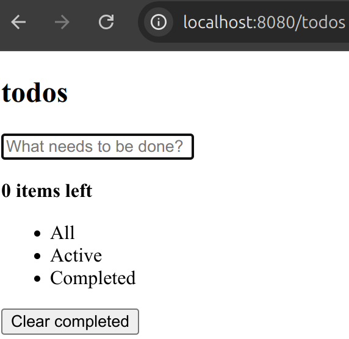
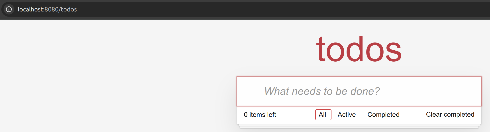
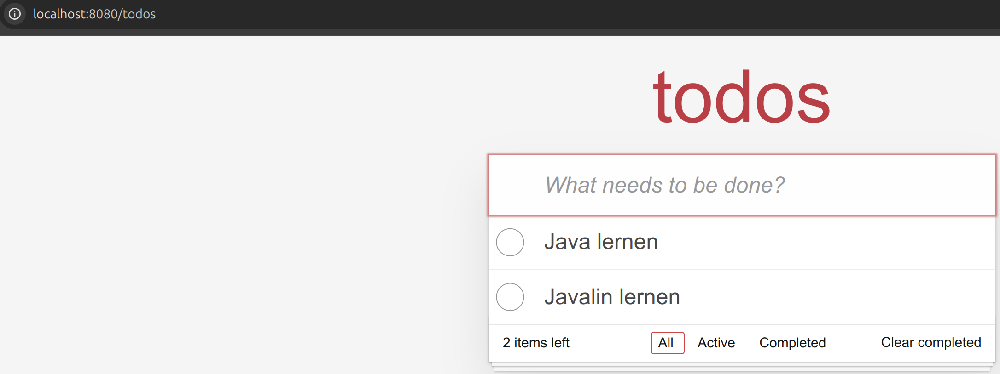
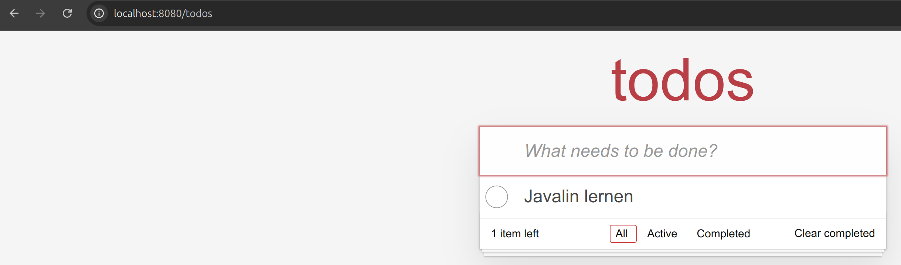

```{.java .cb-run}


```


# Aufgabe

Definiere in einer neuen Datei `ServerView.java` eine Klasse namens `ServerView`. Die Klasse hat ein Attribut vom Typ `TemplateRenderer`. Initialisiere das Attribut in Klassenkörper.


# Aufgabe

Füge die folgende Abhängigkeit in `build.gradle` hinzu.

```kotlin
implementation("io.javalin:javalin:6.7.0")
```


# Aufgabe
Ergänze die Klasse `ServerView` um eine private Methode `setContentTypeAndSend`. Dieser wird der `Context` einer Abfrage und ein String übergeben. Sie setzt den HTTP-Header `Content-Type` auf `text/html`. Anschließend schickt sie den übergebenen String als Antwort auf die Abfrage.


# Aufgabe
Ergänze die Klasse `ServerView` um eine Methode `showApp`. Dieser wird der `Context` einer Abfrage und ein Objekt der Klasse `UIState` übergeben. 
Sie rendert einen String aus dem `UIState`. Bei dem String handelt es sich um ein vollständiges HTML-Dokument. Der String wird anschließend mit der Methode `setContentTypeAndSend` zurück geschickt.


**Hinweis:** Nutze die Methode `setContentTypeAndSend` und die Methode `renderAppToString` der Klasse `TemplateRenderer`. 


# Aufgabe

Definiere in einer neuen Datei `ServerController.java` eine Klasse namens `ServerController`. 
Die Klasse hat ein Attribut vom Typ `Model` und ein Attribut vom Typ `ServerView`. Initialisiere beide Attribute im Klassenkörper.


# Aufgabe
Ergänze die Klasse `ServerController` um eine Methode `showApp`. Dieser wird der `Context` einer Abfrage übergeben. 
Sie sendet eine HTML-Darstellung des aktuellen Zustands als Antwort auf die Abfrage.


**Hinweis:** Nutze die Methode `showApp` der Klasse `ServerView` und die Methode `getUIState` der Klasse `Model`.


```java
// in main
Javalin app =  Javalin.create();
ServerController serverController = new ServerController();
app.get("/todos", serverController::showApp);
```


 { width=50% }


Die Aufrufe der `Javalin`-Methoden `get` und `post` werden in den nächsten Aufgaben ergänzt. Bestehende Aufrufe werden nicht gelöscht.


# Aufgabe

Wir wollen in unserem Projekt Frontend-Bibliotheken nutzen können.
Definiere dafür in der Klasse `Utils` eine statische Methode `configureJavalin`. Dieser wird ein Objekt der Klasse `JavalinConfig` übergeben.
Sie ruft auf dem Attribut `staticFiles` die Methode `enableWebJars` auf. 

Übergib die Methode `configureJavalin` der Methode `create` beim Erzeugen des `Javalin`-Objekts.

# Aufgabe
Zunächst binden wir eine CSS-Bibliothek ein, um das Aussehen unserer App zu verbessern.

Füge dafür die folgende Abhängigkeit in `build.gradle` hinzu.

```kotlin
runtimeOnly("org.webjars.npm:todomvc-app-css:2.4.1")
```


Ergänze im `head`-Tag in `mainPage.jte` die folgende Zeile um den CSS-Code zu importieren.


```html
<link rel="stylesheet" href="/webjars/todomvc-app-css/2.4.1/index.css" type="text/css">
```

Starte deine App und lade die Seite erneut.

 { width=100% }


# Aufgabe
Ergänze die Klasse `ServerController` um eine Methode `addToDo`. Dieser wird der `Context` einer Abfrage übergeben. 
Sie soll auf Eingaben über das Formular in `mainPage.jte` reagieren. Sie fügt die eingegebene Aufgabe dem `Model` hinzu.

Anschließend sendet sie eine HTML-Darstellung des neuen Zustands Antwort auf die Abfrage.


**Hinweis:** Nutze die Methode `showApp` und die Methode `add` der Klasse `Model`.

**Hinweis 2:** Verwende die Methode in einem Aufruf der Javalin-Methode `post`!


 { width=100% }


# Aufgabe

Ergänze in `build.gradle` die Abhängigkeit HTMX:

```kotlin
runtimeOnly("org.webjars.npm:htmx.org:2.0.6")
```

Ergänze im `head`-Tag in `mainPage.jte` die folgende Zeile um die Bibliothek in den Templates verwenden zu können.

```html
<script src="/webjars/htmx.org/2.0.6/dist/htmx.min.js"></script>
```

# Aufgabe

Wenn nach dem ersten Laden der App nochmal der HTML-Code der gesamten App angefragt wird, muss nicht nochmal das gesamte HTML-Dokument mit `header` und `body`-Tag geschickt werden.
In unserer App erfolgen alle Anfragen nach dem ersten Laden der Seite mit HTMX. Solche Anfragen haben den Header `HX-Request`. Ergänze die Methode `showApp` in `ServerView` so, dass geprüft wird, ob dieser Header `null` ist. 
- Wenn er `null` ist, wird die komplette Website geschickt. 
- Wenn er nicht `null` ist, wird nur der Teil im `section`-Tag geschickt.

**Hinweis:** Die Methode `showApp` der Klasse `ServerView` hat bereits einen Parameter, der angibt, ob nur ein Teil der Website gerendert werden soll.


# Aufgabe 

Ergänze das Template `toDo.jte`. Bei einem Klick auf den rechten Button in einem To-do soll eine `POST`-Abfragen gesendet werden. Durch diese soll das To-do gelöscht werden.
Z.B. sendet der rechte Button in dem To-do mit der ID $5 $ eine POST-Anfrage an `todos/5/delete`.


# Aufgabe
Ergänze die Klasse `ServerController` um eine Methode `deleteToDo`. Dieser wird der `Context` einer Abfrage übergeben. 
Sie reagiert auf Anfragen, die durch das Drücken des linken Buttons in einem To-do geschickt wurden. Dabei löscht sie das To-do mit der entsprechenden ID.

**Hinweis:** Nutze die Methode `showApp` und die Methode `delete` der Klasse `Model`.
**Hinweis:** Starte die Methode wie die Methode `addToDo`. Der Pfad muss natürlich angepasst werden.


# Aufgabe 

Ergänze das Template `toDo.jte`. Bei einem Klick auf den rechten Button eines To-dos, soll eine `POST`-Abfragen gesendet werden. Durch diese wird der Status des To-dos geändert.
Z.B. sendet das To-do mit der ID $5$ eine POST-Anfrage an `todos/5/toggle`.


# Aufgabe
Ergänze die Klasse `ServerController` um eine Methode `toggleStatus`. Dieser wird der `Context` einer Abfrage übergeben. 
Sie reagiert auf Anfragen, die durch das Drücken des rechten Buttons in einem To-do geschickt wurden, indem sie den Zustand des To-dos mit der entsprechenden ID ändert.

**Hinweis:** Nutze die Methode `showApp` und die Methode `toggle` der Klasse `Model`.


# Aufgabe 

Ergänze in `app.jte` die Möglichkeit, per Klick auf den Button am Ende des Footers `POST`-Abfragen an `todos/clearCompletedToDos` zu senden. 

# Aufgabe
Ergänze die Klasse `ServerController` um eine Methode `clearCompletedToDos`. Dieser wird der `Context` einer Abfrage übergeben. 
Sie reagiert auf Anfragen, die durch das Drücken des Buttons am Ende des Footers geschickt werden, indem sie alle erledigten To-dos löscht.

**Hinweis:** Nutze die Methode `showApp` und die Methode `removeFinishedToDoItems` der Klasse `Model`.


# Aufgabe 

Ergänze das Template `app.jte`. Bei einem Klick auf einen der Filter-Links in der Mitte des Footers, soll eine `POST`-Abfragen gesendet werden. Mit diesen wird ein neuer Filter ausgewählt.
Z.B. sendet ein Klick auf den Link mit dem Text `All` eine POST-Abfrage an `/todos/setFilter/All`

# Aufgabe
Ergänze die Klasse `ServerController` um eine Methode `setFilter`. Dieser wird der `Context` einer Abfrage übergeben. 
Sie reagiert auf Anfragen, die durch das Drücken Filter-Links in der Mitte des Footers geschickt werden.

**Hinweis:** Nutze die Methode `showApp` und die Methode `removeFinishedToDoItems` der Klasse `Model`.


# Aufgabe 

Ergänze das Template `toDo.jte`. Bei einem Klick auf den Text eines To-dos wird eine  `GET`-Abfrage gesendet. Diese fordert ein Formular an, mit dem der Text des To-dos geändert werden kann. 
Z.B. sendet ein Klick auf den Text des To-dos mit der ID 5 eine GET-Anfrage an  `/todos/5/edit"`. Das komplette Listenelement soll durch die Antwort ersetzt werden.


# Aufgabe
Ergänze die Klasse `ServerView` um eine Methode `showToDo`. Dieser wird der `Context` einer Abfrage, ein `ToDo` und ein Boolean `editing` übergeben.
Die Methode rendert das `ToDo` und schickt das Ergebnis als Antwort auf die Anfrage. Wenn `editing` `true` ist, wird das `ToDo` das Formular gerendert, mit dem der Text des To-dos geändert werden kann.
Ansonsten werden der Status und der Text des To-dos angezeigt.

**Hinweis:** Nutze die Methode `setContentTypeAndSend` und die Methode `renderToDoToString` der Klasse `TemplateRenderer`. 


# Aufgabe

Ergänze die Klasse `ServerController` um eine Methode `showEditForm`. Dieser wird der `Context` einer Abfrage übergeben. 
Sie sendet ein Formular als Antwort auf die Anfrage durch einen Klick auf den Text eines To-dos. 

**Hinweis:** Nutze die Methode `showToDo` und die Methode `getToDoItem` der Klasse `Model`.

 <!-- { width=100% } -->


# Aufgabe

Passe `editingForm.jte` so an, dass der Inhalt des To-dos mit einer Post-Abfrage gesendet wird, wenn das Element den Fokus verliert.
Der Pfad hängt dabei von der ID des To-dos ab. Z.B. sendet ein Formular, das zu dem To-do mit der ID $5$ gehört, eine POST-Anfrage an  `/todos/5/edit"`.
Das komplette Listenelement soll durch die Antwort ersetzt werden.


# Aufgabe

Ergänze die Klasse `ServerController` um eine Methode `updateTextOfToDo`. Dieser wird der `Context` einer Abfrage übergeben. 
Sie reagiert auf Anfragen, die von dem Input-Element in `editingForm` geschickt wurden. Dabei wird der Text des To-dos durch den eingegebene Text ersetzt.

**Hinweis:** Nutze die Methode `showToDo` und die Methode `updateText` der Klasse `Model`.

#

Nutze HTMX um beim Hinzufügen eines To-dos nicht immer die ganze Seite neu zu laden. Ändere dafür das Formular mit dem To-dos hinzugefügt werden. 

# Aufgabe

Teste deine App!

# Aufgabe

Hilf den anderen SuS!
