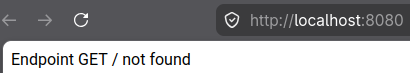
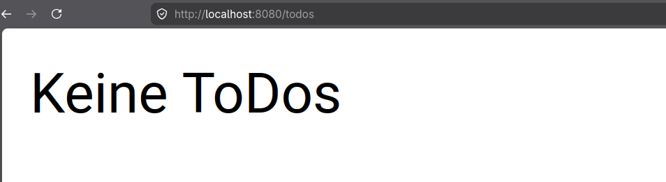
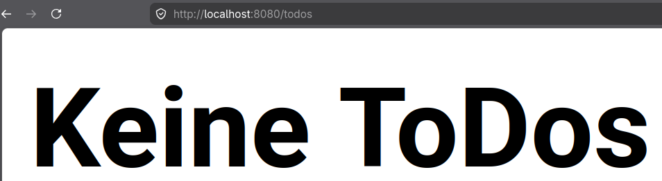
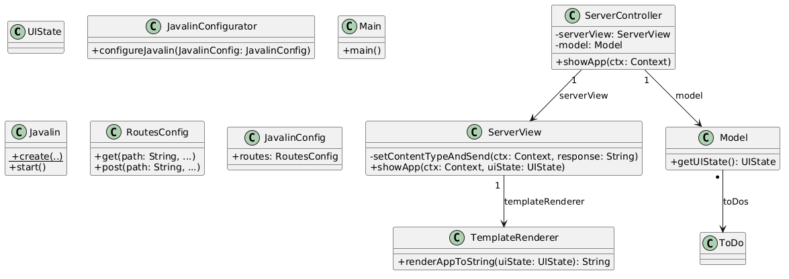
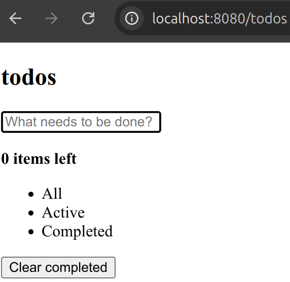
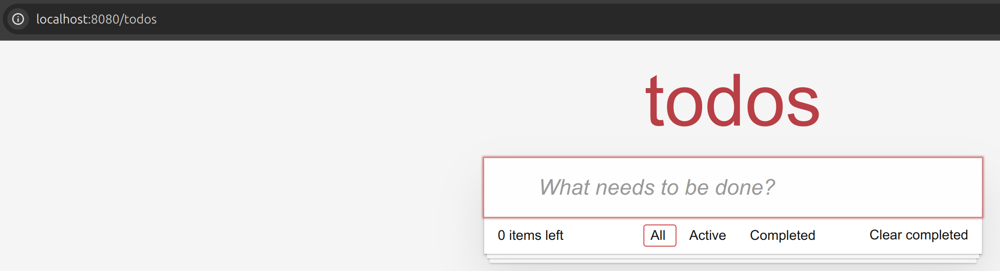
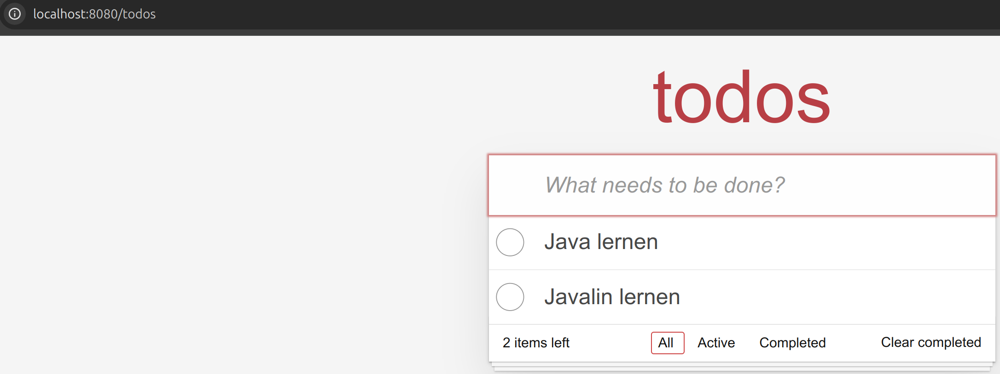
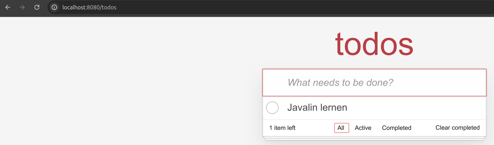

```{.java .cb-run}


```


# Grundlagen

## Aufgabe

Falls du `Gradle` verwendest, füge die folgende Abhängigkeit in `build.gradle` ein.

```kotlin
implementation("io.javalin:javalin:7.0.1")
```

Falls du `Maven` verwendest, füge die folgenden Abhängigkeiten in `pom.xml` ein.


```xml
<dependency>
    <groupId>io.javalin</groupId>
    <artifactId>javalin</artifactId>
    <version>7.0.1</version>
</dependency>
<dependency>
    <groupId>org.slf4j</groupId>
    <artifactId>slf4j-simple</artifactId>
    <version>2.0.17</version>
</dependency>
```


## Aufgabe

Erzeuge in der `main`-Methode mit `Javalin.create` einen Javalin-Server. Starte ihn anschließend, indem du auf dem erzeugten Server-Objekt die Methode `start` aufrufst.


## Aufgabe

Teste den Server, indem du die von IntelliJ angezeigte URL aufrufst.

{ width=50% }


Da noch keine Routen definiert sind, wird `Endpoint GET / not found` angezeigt.


## Aufgabe

Definiere in einer neuen Datei `ServerController.java` eine Klasse mit dem Namen `ServerController`.

## Aufgabe

Ergänze in der Datei `ServerController.java` den folgenden Import.
```java
import io.javalin.http.Context;
```

## Aufgabe

Ergänze die Klasse `ServerController` um die Methode `showApp(Context ctx)`. Sie beantwortet Anfragen, indem sie den String `"Keine ToDos"` zurück sendet.

**Hinweis:** Nutze die Methode `result` der Klasse `Context`.


## Aufgabe

Definiere in einer neuen Datei `JavalinConfigurator.java` eine Klasse mit dem Namen `JavalinConfigurator`.


## Aufgabe

Ergänze die Klasse `JavalinConfigurator` um die statische Methode `configureJavalin(JavalinConfig javalinConfig)`. Diese Methode erzeugt zunächst ein Objekt der Klasse `ServerController`.

Rufe anschließend über die Eigenschaft `routes` des Parameters `javalinConfig` die Methode `get` so auf, dass Anfragen an den Pfad `/todos` von der Methode `showApp` der Klasse `ServerController` beantwortet werden.

## Aufgabe

Passe die `main`-Methode so an, dass der Javalin-Server mit `JavalinConfigurator::configureJavalin` konfiguriert wird.


## Aufgabe

Teste die neue Route.


{ width=100% }


## Aufgabe

Definiere in einer neuen Datei `ServerView.java` eine Klasse mit dem Namen `ServerView`.

## Aufgabe
Ergänze die Klasse `ServerView` um die private Methode `setContentTypeAndSend(Context ctx, String response)`. Sie setzt den HTTP-Header `Content-Type` auf `text/html` und sendet anschließend den übergebenen String als Antwort.

**Hinweis:** Nutze die Methoden `contentType` und `result` der Klasse `Context`.


## Aufgabe

Ergänze die Klasse `ServerController` um ein Attribut vom Typ `ServerView`. Initialisiere es direkt in der Klasse.


## Aufgabe

Ergänze die Klasse `ServerView` um die Methode `showApp(Context ctx, String response)`. Sie sendet den Parameter `response` mithilfe der Methode `setContentTypeAndSend` als Antwort auf die Anfrage.


## Aufgabe

Passe die Methode `showApp` der Klasse `ServerController` so an, dass sie die Methode `showApp` der Klasse `ServerView` verwendet, um den Content-Type auf `text/html` zu setzen und den String `"<h1>Keine To-dos</h1>"` zurückzusenden.

## Aufgabe

Teste die Route `/todos` noch einmal.

{ width=100% }


# Implementierung der To-do-App

## Aufgabe

Ergänze die Klasse `ServerController` um ein Attribut vom Typ `Model`. Initialisiere es direkt in der Klasse.


## Aufgabe

Ergänze die Klasse `ServerView` um ein Attribut vom Typ `TemplateRenderer`. Initialisiere es direkt in der Klasse.

## Übersicht

Das folgende Klassendiagramm zeigt die wichtigsten Bestandteile der App und ihre Zusammenarbeit mit `Javalin`.

{ width=100% }

- `UIState` enthält alle Daten, die zum Anzeigen der Oberfläche benötigt werden.
- `Model` verwaltet den Zustand der App. Es stellt Methoden bereit, um To-dos hinzuzufügen, zu löschen und zu ändern. Der aktuelle Zustand wird mit `getUIState` abgefragt.
- `TemplateRenderer` übersetzt den Zustand der App in HTML.
- `ServerView` rendert HTML und sendet dieses als Antwort auf HTTP-Anfragen.
- `ServerController` verarbeitet HTTP-Anfragen und nutzt dafür `ServerView` und `Model`.
- `Javalin` stellt die Methoden `create` und `start` bereit.
- `Main` enthält die Methode `main`, in der die `Javalin`-App erstellt und gestartet wird.
- `Routes` hat die Methoden `get` und `post`, mit denen Routen zur App hinzugefügt werden.
- `JavalinConfig` hat eine Eigenschaft `routes` vom Typ `Routes`.
- `JavalinConfigurator` enthält die Methode `configureJavalin(JavalinConfig javalinConfig)`, in der Routen konfiguriert und mit Methoden von `ServerController` verknüpft werden.


In den nächsten Aufgaben implementierst du weitere Methoden in `ServerView` und `ServerController` und bindest sie in `configureJavalin` ein, damit weitere Routen verarbeitet werden können.


## Aufgabe
Ergänze die Klasse `ServerView` um die Methode `showApp(Context ctx, UIState uiState)`. Sie rendert aus dem `UIState` ein vollständiges HTML-Dokument und sendet es anschließend mit der Methode `setContentTypeAndSend` zurück.


**Hinweis:** Nutze die Methoden `setContentTypeAndSend` und `renderAppToString` der Klasse `TemplateRenderer`.

## Aufgabe

Lösche die Methode `showApp(Context ctx, String response)`!


## Aufgabe
Ändere die Methode `showApp(Context ctx)` der Klasse `ServerController`. Die Methode soll die folgenden Schritte durchführen:

- Sie fragt den aktuellen Zustand des Modells mit der Methode `getUIState` der Klasse `Model` ab.
- Sie sendet eine HTML-Darstellung des aktuellen Zustands mit der Methode `showApp` der Klasse `ServerView`.


## Aufgabe

Teste die App.


<!-- ```java
// in main
Javalin app =  Javalin.create();
ServerController serverController = new ServerController();
app.get("/todos", serverController::showApp);
``` -->


 { width=50% }


Die Aufrufe der `Javalin`-Methoden `get` und `post` in `configureJavalin` werden in den nächsten Aufgaben schrittweise ergänzt. Bereits vorhandene Aufrufe werden dabei nicht gelöscht, sondern nur erweitert.


# Verwendung von CSS

## Aufgabe

Wir wollen in unserem Projekt Frontend-Bibliotheken nutzen können. Ergänze dafür in `configureJavalin(JavalinConfig javalinConfig)` einen Aufruf der Methode `enableWebjars` über die Eigenschaft `staticFiles` des Parameters.


## Aufgabe
Zunächst binden wir eine CSS-Bibliothek ein, um das Aussehen unserer App zu verbessern.

Füge dafür die folgende Abhängigkeit in `build.gradle` ein.

```kotlin
runtimeOnly("org.webjars.npm:todomvc-app-css:2.4.3")
```

Oder füge sie in `pom.xml` hinzu.

```xml
<dependency>
    <groupId>org.webjars.npm</groupId>
    <artifactId>todomvc-app-css</artifactId>
    <version>2.4.3</version>
</dependency>
```

Ergänze im `head`-Tag in `mainPage.jte` die folgende Zeile, um das CSS einzubinden.


```html
<link rel="stylesheet" href="/webjars/todomvc-app-css/2.4.3/index.css" type="text/css">
```

Starte deine App und lade die Seite erneut.

 { width=100% }


# Feature: Hinzufügen von To-dos


## Aufgabe
Ergänze die Klasse `ServerController` um die Methode `addToDo(Context ctx)`. Sie soll auf Eingaben über das Formular in `mainPage.jte` reagieren, die eingegebene Aufgabe zum `Model` hinzufügen und anschließend eine HTML-Darstellung des neuen Zustands als Antwort senden.


**Hinweis:** Nutze die Methoden `formParam` der Klasse `Context`, `add` der Klasse `Model` und `showApp` der Klasse `ServerController`.

## Aufgabe

Verknüpfe die POST-Anfrage des Formulars zum Hinzufügen von To-dos mit der Methode `addToDo` der Klasse `ServerController`. Registriere dafür in `JavalinConfigurator` eine passende Route für den Pfad `/todos/new`.

 { width=100% }


# Verwendung von HTMX


## Aufgabe

Ergänze die Abhängigkeit für HTMX in `build.gradle` 

```kotlin
runtimeOnly("org.webjars.npm:htmx.org:2.0.8")
```

oder, falls du Maven verwendest, in `pom.xml`:

```xml
<dependency>
    <groupId>org.webjars.npm</groupId>
    <artifactId>htmx.org</artifactId>
    <version>2.0.8</version>
</dependency>
```

Ergänze im `head`-Tag in `mainPage.jte` die folgende Zeile, um die Bibliothek in den Templates verwenden zu können.

```html
<script src="/webjars/htmx.org/2.0.8/dist/htmx.min.js"></script>
```

## Aufgabe

Momentan sendet die Methode `showApp(Context ctx, UIState uiState)` der Klasse `ServerView` immer die komplette Website. Beim Hinzufügen, Löschen, usw. ändert sich jedoch nur Teil der Website der in dem Tag 

```html
<section class="todoapp" id="todoapp">


</section>
```

enthalten ist. Dieser Teil der Website wird mit dem Template `app.jte` gerendert. Beim ersten Anfragen der Website wird eine normale HTTP GET Anfrage gesendet. Alle weiteren Anfragen erfolgen mit HTMX. Solche Anfragen haben den Header `HX-Request`. Ergänze die Methode `showApp(Context ctx, UIState uiState)` in `ServerView` so, dass dieser Header geprüft wird.

- Wenn er `null` ist, wird die komplette Webseite gesendet.
- Wenn er nicht `null` ist, wird nur der Teil im `section`-Tag gesendet.

**Hinweise:** 

- Die Methode `renderAppToString` der Klasse `TemplateRenderer` hat bereits einen Parameter, der angibt, ob nur ein Teil der Webseite gerendert werden soll. 
- Nutze die Methode `header(String key)` der Klasse `Context`. Diese gibt den Wert des Headers mit dem Schlüssel `key` zurück.


# Feature: Löschen von To-dos


## Aufgabe

Ergänze das Template `toDo.jte`. Bei einem Klick auf den rechten Button eines To-dos soll eine `POST`-Anfrage gesendet werden. Dadurch wird das To-do gelöscht. Der Zielpfad der Anfrage hängt nur von der ID des jeweiligen To-dos ab.
Beispiele:

- der rechte Button in dem To-do mit der ID $5$ sendet eine POST-Anfrage an `/todos/5/delete`.
- der rechte Button in dem To-do mit der ID $8$ sendet eine POST-Anfrage an `/todos/8/delete`.


## Aufgabe
Ergänze die Klasse `ServerController` um die Methode `deleteToDo(Context ctx)`. Sie reagiert auf Anfragen, die durch das Drücken des rechten Buttons eines To-dos ausgelöst werden, und löscht das To-do mit der entsprechenden ID.

**Hinweis:** Nutze die Methoden `pathParam` der Klasse `Context`, `Integer.parseInt`, `delete` der Klasse `Model` und `showApp` der Klasse `ServerController`.


## Aufgabe
Nutze die Methode `deleteToDo` der Klasse `ServerController`, um auf POST-Anfragen zu reagieren. Registriere dafür in `JavalinConfigurator` eine passende Route für den Pfad `/todos/{id}/delete`.


# Feature: Status eines To-dos ändern


## Aufgabe

Ergänze das Template `toDo.jte`. Bei einem Klick auf den linken Button eines To-dos soll eine `POST`-Anfrage gesendet werden. Dadurch wird der Status des To-dos geändert. Der Zielpfad der Anfrage hängt also von der ID des jeweiligen To-dos ab.
Beispiele: 

- das To-do mit der ID $5$ sendet eine POST-Anfrage an `/todos/5/toggle`
- das To-do mit der ID $8$ sendet eine POST-Anfrage an `/todos/8/toggle`


## Aufgabe
Ergänze die Klasse `ServerController` um die Methode `toggleStatus(Context ctx)`. Sie reagiert auf Anfragen, die durch das Drücken des linken Buttons eines To-dos ausgelöst werden, indem sie den Status des To-dos mit der entsprechenden ID ändert.

**Hinweis:** Nutze die Methoden `pathParam` der Klasse `Context`, `Integer.parseInt`, `toggle` der Klasse `Model` und `showApp` der Klasse `ServerController`.

## Aufgabe
Nutze die Methode `toggleStatus` der Klasse `ServerController`, um auf POST-Anfragen zu reagieren. Registriere dafür in `JavalinConfigurator` eine passende Route für den Pfad `/todos/{id}/toggle`.


# Feature: Alle fertigen To-dos löschen


## Aufgabe

Ergänze in `app.jte` die Möglichkeit, per Klick auf den Button am Ende des Footers eine `POST`-Anfrage an `/todos/clearCompletedToDos` zu senden.

## Aufgabe
Ergänze die Klasse `ServerController` um die Methode `clearCompletedToDos(Context ctx)`. Sie reagiert auf Anfragen, die durch das Drücken des Buttons am Ende des Footers ausgelöst werden, indem sie alle erledigten To-dos löscht.

**Hinweis:** Nutze die Methode `removeFinishedToDoItems` der Klasse `Model` und `showApp` der Klasse `ServerController`.


## Aufgabe
Nutze die Methode `clearCompletedToDos` der Klasse `ServerController`, um auf POST-Anfragen zu reagieren. Registriere dafür in `JavalinConfigurator` eine passende Route für den Pfad `/todos/clearCompletedToDos`.


# Feature: To-dos filtern


## Aufgabe

Ergänze das Template `app.jte`. Bei einem Klick auf einen der Filter-Links in der Mitte des Footers soll eine `POST`-Anfrage gesendet werden. Dadurch wird ein neuer Filter ausgewählt. Der Zielpfad der Anfrage hängt also vom Text des angeklickten Filters ab.
Beispiele:

- ein Klick auf den Link mit dem Text `All` sendet eine POST-Anfrage an `/todos/setFilter/All`.
- ein Klick auf den Link mit dem Text `Completed` sendet eine POST-Anfrage an `/todos/setFilter/Completed`.


## Aufgabe
Ergänze die Klasse `ServerController` um die Methode `setFilter(Context ctx)`. Sie reagiert auf Anfragen, die durch das Anklicken der Filter-Links in der Mitte des Footers ausgelöst werden.

**Hinweis:** Nutze die Methoden `pathParam` der Klasse `Context`, `setFilter` der Klasse `Model` und `showApp` der Klasse `ServerController`.

## Aufgabe
Nutze die Methode `setFilter` der Klasse `ServerController`, um auf POST-Anfragen zu reagieren. Registriere dafür in `JavalinConfigurator` eine passende Route für den Pfad `/todos/setFilter/{filter}`.


# Feature: Text eines To-dos ändern


## Aufgabe

Ergänze das Template `toDo.jte`. Bei einem Klick auf den Text eines To-dos wird eine `GET`-Anfrage gesendet. Dadurch wird ein Formular angefordert, mit dem der Text des To-dos geändert werden kann. Der Zielpfad der Anfrage hängt also von der ID des jeweiligen To-dos ab.
Beispiele:   

- ein Klick auf den Text des To-dos mit der ID 5 sendet eine GET-Anfrage an `/todos/5/edit`
- ein Klick auf den Text des To-dos mit der ID 9 sendet eine GET-Anfrage an `/todos/9/edit`


Das komplette Listenelement des angeklickten To-dos soll durch die Serverantwort ersetzt werden.


## Aufgabe
Ergänze die Klasse `ServerView` um eine Methode `showToDo(Context ctx, ToDo toDo, boolean editing)`.
Die Methode rendert das `ToDo` und sendet das Ergebnis als Antwort auf die Anfrage. Wenn `editing` den Wert `true` hat, wird für das `ToDo` das Formular gerendert, mit dem der Text des To-dos geändert werden kann. Andernfalls werden der Status und der Text des To-dos angezeigt.

**Hinweis:** Nutze die Methoden `setContentTypeAndSend` der Klasse `ServerView` und `renderToDoToString` der Klasse `TemplateRenderer`.


## Aufgabe

Ergänze die Klasse `ServerController` um die Methode `showEditForm(Context ctx)`. Sie sendet als Antwort auf die Anfrage ein Formular, das durch einen Klick auf den Text eines To-dos angefordert wurde.

**Hinweis:** Nutze die Methoden `pathParam` der Klasse `Context`, `Integer.parseInt`, `getToDoItem` der Klasse `Model` und `showToDo` der Klasse `ServerView`.
 <!-- { width=100% } -->

## Aufgabe


Nutze die Methode `showEditForm` der Klasse `ServerController`, um auf GET-Anfragen zu reagieren. Registriere dafür in `JavalinConfigurator` eine passende Route für den Pfad `/todos/{id}/edit`.


## Aufgabe

Passe `editingForm.jte` so an, dass der Inhalt des To-dos mit einer POST-Anfrage gesendet wird, sobald das Eingabefeld den Fokus verliert.
Der Pfad hängt dabei von der ID des To-dos ab. Beispiele:


- das Formular, das zu dem To-do mit der ID $5$ gehört, sendet eine POST-Anfrage an `/todos/5/edit`
- das Formular, das zu dem To-do mit der ID $2$ gehört, sendet eine POST-Anfrage an `/todos/2/edit`

Das komplette Listenelement des bearbeiteten To-dos soll durch die Antwort ersetzt werden.


## Aufgabe

Ergänze die Klasse `ServerController` um die Methode `updateTextOfToDo(Context ctx)`. Sie reagiert auf Anfragen, die vom Input-Element in `editingForm` ausgelöst werden. Dabei wird der Text des To-dos durch den eingegebenen Text ersetzt.


**Hinweis:** Nutze die Methoden `pathParam` und `formParam` der Klasse `Context`, `Integer.parseInt`, `updateText` der Klasse `Model`, `getToDoItem` der Klasse `Model` und `showToDo` der Klasse `ServerView`.

## Aufgabe


Nutze die Methode `updateTextOfToDo` der Klasse `ServerController`, um auf POST-Anfragen zu reagieren. Registriere dafür in `JavalinConfigurator` eine passende Route für den Pfad `/todos/{id}/edit`.


# Fertigstellen der App

## Aufgabe

Nutze HTMX, damit beim Hinzufügen eines To-dos nicht immer die gesamte Seite neu geladen wird. Ändere dafür das Formular, mit dem To-dos hinzugefügt werden, so dass die Anfrage per HTMX gesendet und die `section` mit der To-do-App durch die Serverantwort aktualisiert wird.

## Aufgabe

Teste deine App.

## Aufgabe

Hilf den anderen SuS!
