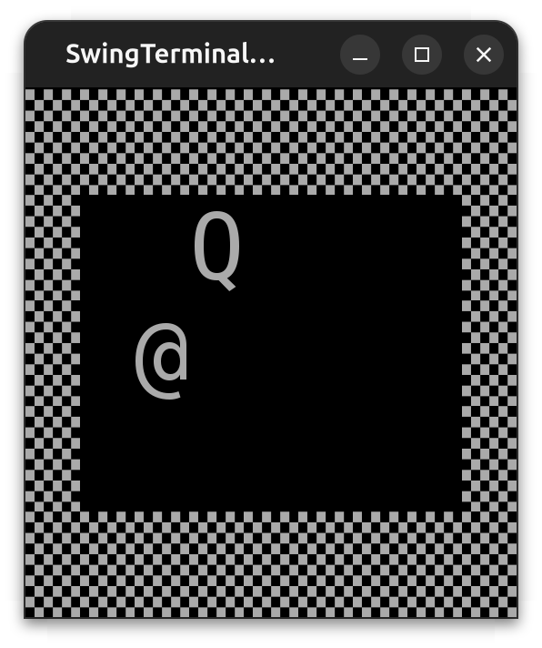
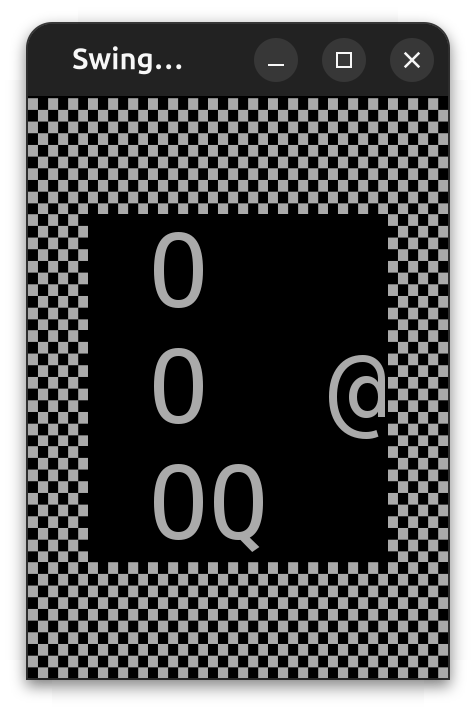

```{.java .cb-run}
//import java.util.Random;


record V2(int x, int y) {

    V2 plus(V2 other) {
        return new V2(x + other.x(), y + other.y());
    }

    int times(V2 other) {
        return x * other.x() + y * other.y();
    }

}


V2 keyToV2(char pressedKey) {
    return switch (pressedKey) {
        case 'w' -> new V2(0, -1);
        case 'd' -> new V2(1, 0);
        case 's' -> new V2(0, 1);
        case 'a' -> new V2(-1, 0);
        default -> new V2(0, 0);
    };
}


V2 computeNewDirection(V2 currentDirection, char pressedKey) {
    var maybeNewDir = keyToV2(pressedKey);
    if (!maybeNewDir.equals(new V2(0, 0)) && maybeNewDir.times(currentDirection) == 0) return maybeNewDir;
    else return currentDirection;
}


static <T> List<T> dropLast(List<T> xs) {
    var acc = new ArrayList<T>();
    for (int i = 0; i < xs.size() - 1; i++) {
        acc.add(xs.get(i));
    }
    return acc;
//     var acc = new ArrayList<T>(xs);
//     acc.removeLast()
}


boolean isOnBoard(V2 v, int cols, int rows) {
    return v.x() < cols && v.x() >= 0 && v.y() < rows && v.y() >= 0;
}


V2 generateRandomFreeCoordinates(List<V2> blockedCoordinates, int rows, int cols) {
    while (true) {
        Random random = new Random();
        var newAppleX = random.nextInt(0, cols);
        var newAppleY = random.nextInt(0, rows);
        var newAppleCoordinates = new V2(newAppleX, newAppleY);
        if (!blockedCoordinates.contains(newAppleCoordinates)) {
            return newAppleCoordinates;
        }
    }
}

record Snake(
        V2 head,
        List<V2> tail,
        boolean digesting
) {

    Snake(V2 head) {
        this(head, List.of(), false);
    }

    List<V2> getCoordinates() {
        var res = new ArrayList<V2>();
        res.add(head);
        for (var v2 : tail) {
            res.add(v2);
        }
        return res;
    }

    boolean tailBitten() {
        return tail.contains(head);
    }

    Snake move(V2 direction, V2 applePosition) {
        var newSnakeHead = direction.plus(head);
        var newDigesting = newSnakeHead.equals(applePosition);
        var newSnakeBody = getCoordinates();
        if (!digesting) {
            newSnakeBody = dropLast(newSnakeBody);
        }

        return new Snake(newSnakeHead, newSnakeBody, newDigesting);
    }


}

record UIState(V2 snakeHead, List<V2> snakeTail, V2 applePosition) {
}

class Model {

     final int cols;
     final int rows;
     Snake snake;
    V2 direction;
     V2 applePosition;

    Model(int cols, int rows, Snake snake, V2 direction, V2 applePosition) {
        this.cols = cols;
        this.rows = rows;
        this.snake = snake;
        this.direction = direction;
        this.applePosition = applePosition;
    }
    
    
    Model(int cols, int rows) {
        this(cols,rows,new Snake(new V2(cols / 2, rows / 2)), new V2(1, 0), new V2(cols - 1, rows - 1));
    }

    boolean snakeIsAlive() {
        return isOnBoard(snake.head(), cols, rows) && !snake.tailBitten();
    }

    boolean boardIsFull() {
        return snake.getCoordinates().size() == rows * cols;
    }

    boolean gameOngoing() {
        return snakeIsAlive() && !boardIsFull();
    }

    UIState getUIState() {
        return new UIState(snake.head(), snake.tail(), applePosition);
    }

    void moveSnake() {
        snake = snake.move(direction, applePosition);
        if (snake.digesting() && !boardIsFull()) {
            applePosition = generateRandomFreeCoordinates(snake.getCoordinates(), rows, cols);
        }
    }

    void setDirection(char key) {
        direction = computeNewDirection(direction, key);
    }

    String getEndMessage() {
        if (boardIsFull()) return "won";
        else return "lost";
    }

}


```
<!-- # Aufgabe

Implementiere eine Funktion `contains`. Dieser wird eine Liste und ein einzelnes Element übergeben. Die Elemente in der Liste und dieses Element haben denselben Typ. Die Funktion gibt zurück, ob das einzelne Element in der Liste enthalten ist.

```{.java .cb-nb first_number=1}
contains(List.of(1, 2, 3) , 4)
```

```{.java .cb-nb first_number=1}
contains(List.of("hello", "how", "are", "you", "?") , "are")
``` -->

# Aufgabe

Erstelle eine Datenklasse `V2`{.java}. Die Objekte dieser Klasse sind Vektoren im zweidimensionalen Raum mit ganzzahligen Komponenten. Beide Komponenten sind unveränderlich.

```{.java .cb-nb first_number=1}
new V2(3, 2);
```
```{.java .cb-nb first_number=1}
new V2(1, -5);
```


# Aufgabe
Erweitere die Datenklasse `V2`{.java} um die Methode `plus`{.java}. Dieser wird ein Vektor übergeben. Es wird die Summe der beiden Vektoren zurückgegeben.


```{.java .cb-nb first_number=1}
new V2(3, 2).plus(new V2(1, -5));
```
```{.java .cb-nb first_number=1}
new V2(3, 4).plus(new V2(-4, -5));
```
**Hinweis:**
 
$$\begin{pmatrix} v_{1} \\ v_{2}\end{pmatrix} +  \begin{pmatrix} w_{1} \\ w_{2} \end{pmatrix} = \begin{pmatrix}  v_{1} + w_{1} \\ v_{2} + w_{2} \end{pmatrix}$$


# Aufgabe
Erweitere die Datenklasse `V2`{.java} um die Methode `times`{.java}. Dieser wird ein Vektor übergeben. Es wird das Skalarprodukt der beiden Vektoren zurückgegeben.


```{.java .cb-nb first_number=1}
new V2(1, 2).times(new V2(3, 4))
```
```{.java .cb-nb first_number=1}
new V2(3, 2).times(new V2(1, -5))
```

**Hinweis:** 

$$\begin{pmatrix} v_1 \\ v_2 \end{pmatrix} \cdot \begin{pmatrix} w_1 \\ w_2 \end{pmatrix} =  v_1 w_1 + v_2 w_2 $$


# Aufgabe
Implementiere eine Funktion `keyToV2`{.java}. Diese bestimmt den Richtungsvektor zu einem Character, der für eine Richtung steht. Wenn nicht `w`, `a`, `s` oder `d` gedrückt wurde, wird der Nullvektor zurückgegeben. Dabei werden Terminal-Koordinaten verwendet. Der Unterschied zu dem Koordinatensystem aus dem Matheunterricht ist die Richtung der $y$-Achse.

\begin{center}
\begin{tikzpicture}[y=-1cm, scale = 3]
  \draw[-latex] (0,0) -- (1,0) node[below] {$x$};
  \draw[-latex] (0,0) -- (0,1) node[left] {$y$};
\end{tikzpicture}
\end{center}


```{.java .cb-nb first_number=1}
keyToV2('w')
```
```{.java .cb-nb first_number=1}
keyToV2('a')
```
```{.java .cb-nb first_number=1}
keyToV2('s')
```
```{.java .cb-nb first_number=1}
keyToV2('d')
```
```{.java .cb-nb first_number=1}
keyToV2('i')
```


# Aufgabe
Implementiere eine Funktion `computeNewDirection`{.java}. Dieser wird die aktuelle Richtung der Schlange als `V2` und die zuletzt drückte Taste als Character übergeben. Sie gibt die neue Richtung zurück. Die Richtung wird nur geändert, wenn eine Richtungstaste gedrückt wurde und die gewünschte Richtung orthogonal zur aktuellen Richtung ist. Außerdem darf die neue Richtung nicht der Nullvektor sein.

```{.java .cb-nb first_number=1}
computeNewDirection(new V2(1, 0), 'w');
```
```{.java .cb-nb first_number=1}
computeNewDirection(new V2(0, 1), 's');
```
```{.java .cb-nb first_number=1}
computeNewDirection(new V2(0, 1), 't');
```
**Hinweis:** Zwei Vektoren sind orthogonal zueinander, wenn ihr Skalarprodukt $0$ ist.


# Aufgabe
Implementiere eine Funktion `dropLast`{.java}. Dieser wird eine Liste übergeben. Sie gibt die Liste ohne das letzte Element zurück. Wenn die übergebene Liste leer ist, wird auch die leere Liste zurückgegeben.

```{.java .cb-nb first_number=1}
dropLast(List.of('i', 'a'));
```
```{.java .cb-nb first_number=1}
dropLast(new ArrayList<>());
```
```{.java .cb-nb first_number=1}
dropLast(List.of(new V2(5, 5), new V2(4, 5), new V2(4, 6)));
```


# Aufgabe 
Implementiere eine Funktion `isOnBoard`{.java}. Dieser werden 

- die Koordinaten einer Zelle als `V2` und 
- die Anzahl der Spalten und Zeilen des Spielfelds 

übergeben. Sie gibt zurück, ob diese Zelle auf dem Spielfeld ist. Die $x$- und $y$-Koordinaten der Zellen des Spielfelds werden hierfür mit $0$ beginnend durchnummeriert.

```{.java .cb-nb first_number=1}
isOnBoard(new V2(3, 4), 4, 5)
```
```{.java .cb-nb first_number=1}
isOnBoard(new V2(6, 5), 6, 7)
```
```{.java .cb-nb first_number=1}
isOnBoard(new V2(6, 5), 7, 5)
```
```{.java .cb-nb first_number=1}
isOnBoard(new V2(3, 2), 7, 5)
```
```{.java .cb-nb first_number=1}
isOnBoard(new V2(3, -2), 7, 5)
```


# Aufgabe

In der nächsten Aufgabe brauchst du die Klasse `Random`

```{.java .cb-nb first_number=1}
var random = new Random();
```

Diese hat eine Methode `nextInt`.
Dieser werden zwei positive ganze Zahl $n$ und $m$ übergeben. Sie gibt eine zufällige natürliche Zahl zurück, die mindestens $n$ und **echt kleiner** als $m$ ist.

```{.java .cb-nb first_number=1}
random.nextInt(0, 5);
```

```{.java .cb-nb first_number=1}
random.nextInt(0, 5);
```


# Aufgabe
Implementiere eine Funktion `generateRandomFreeCoordinates`{.java}. Dieser werden 

- eine Liste der Koordinaten aller belegten Zellen und 
- die Anzahl der Zeilen 
- die Anzahl der Spalten des Spielfelds 

übergeben. Sie gibt die Koordinaten einer zufällig ausgewählten freien Zelle zurück.

```{.java .cb-nb first_number=1}
generateRandomFreeCoordinates(List.of(new V2(0,0), new V2(1,0), new V2(0,1)), 2, 2);
```
```{.java .cb-nb first_number=1}
generateRandomFreeCoordinates(List.of(new V2(0,0), new V2(1,0), new V2(0,1)), 3, 2);
```
```{.java .cb-nb first_number=1}
generateRandomFreeCoordinates(List.of(new V2(0,0), new V2(1,0), new V2(0,1)), 3, 2);
```

**Hinweis:** Nutze `nextInt` und die Listen-Methode `contains`!

```{.java .cb-nb first_number=1}
List.of(1, 2, 3).contains(4);
```
```{.java .cb-nb first_number=1}
List.of(1, 2).contains(2);
```


# Aufgabe

Implementiere eine Daten-Klasse `Snake`. Die Eigenschaften der Klasse sind

- die Postion des Schlangenkopfes als Vektor
- die Postion aller anderen Teile der Schlange als Liste von Vektoren
- ein Boolean, das angibt, ob die Schlange gerade verdaut

 
```{.java .cb-nb first_number=1}
new Snake(new V2(6, 5), List.of(new V2(5, 5), new V2(4, 5), new V2(4, 6)), true);
```
```{.java .cb-nb first_number=1}
new Snake(new V2(1, 0), new ArrayList<V2>(), false);
```


# Aufgabe
Erweitere die Klasse `Snake` um eine Methode   `getCoordinates`{.java}. Diese gibt eine Liste aller Koordinaten der Schlange zurück.
Das erste Element dieser Liste ist der Kopf der Schlange. Die Reihenfolge der übrigen Elemente wird nicht verändert.
```{.java .cb-nb first_number=1}
new Snake(new V2(6, 5), List.of(new V2(5, 5), new V2(4, 5), new V2(4, 6)), true).getCoordinates();
```
```{.java .cb-nb first_number=1}
new Snake(new V2(1, 0), List.of(), false).getCoordinates();
```


# Aufgabe
Erweitere die Klasse `Snake` um eine Methode  `tailBitten`{.java}. Diese gibt zurück, ob sich die Schlange selbst gebissen hat.
```{.java .cb-nb first_number=1}
new Snake(new V2(6, 5), List.of(new V2(5, 5), new V2(4, 5), new V2(4, 6)), true).tailBitten()
```
\small
```{.java .cb-nb first_number=1}
new Snake(new V2(2, 3), 
      List.of(new V2(3, 3), new V2(4, 3), new V2(4,2), new V2(4, 1), 
             new V2(3, 1), new V2(2, 1), new V2(2, 2), new V2(2, 3)), 
      false).tailBitten()
```
\normalsize


# Aufgabe 
Erweitere die Klasse `Snake` um eine Methode `move`{.java}. Dieser wird die Richtung der Schlange und die Position des Apfels gegeben. Sie gibt die neue Schlange zurück.

- Die Schlange bewegt sich in die übergebene Richtung.

- Wenn die Schlange gerade verdaut, behält sie die letzte Zelle. Ansonsten verliert sie diese.

- Wenn der Kopf der Schlange nach der Bewegung auf dem Apfel ist, isst die Schlange den Apfel und verdaut diesen. Ansonsten verdaut sie nicht mehr.

```{.java .cb-nb first_number=1}
new Snake(new V2(6, 5), List.of(new V2(5, 5), new V2(4, 5)), true).move(new V2(1, 0), new V2(7, 9))
```
\begin{figure}[ht!]
\centering
\begin{tikzpicture}[y=-1cm, scale = 0.5]
  \draw[-latex] (0,0) -- (1,0) node[below] {$x$};
  \draw[-latex] (0,0) -- (0,1) node[left] {$y$};
\draw[step=1cm,black,very thin] (0,0) grid (10,10);
\fill[green] (6,5) rectangle (7,6);
\fill[green] (5,5) rectangle (6,6);
\fill[green] (4,5) rectangle (5,6);
\fill[green] (5,5) rectangle (6,6);
\fill[red] (7,9) rectangle (8,10);
\end{tikzpicture}
\hspace{1cm}
\begin{tikzpicture}[y=-1cm, scale = 0.5]
  \draw[-latex] (0,0) -- (1,0) node[below] {$x$};
  \draw[-latex] (0,0) -- (0,1) node[left] {$y$};
\draw[step=1cm,black,very thin] (0,0) grid (10,10);
\fill[green] (7,5) rectangle (8,6);
\fill[green] (6,5) rectangle (7,6);
\fill[green] (5,5) rectangle (6,6);
\fill[green] (4,5) rectangle (5,6);
\fill[red] (7,9) rectangle (8,10);
\end{tikzpicture}
\end{figure}


```{.java .cb-nb first_number=1}
new Snake(new V2(4, 5), List.of(new V2(4, 4)), false).move(new V2(0, 1), new V2(4, 6))
```

\begin{figure}[ht!]
\centering
\begin{tikzpicture}[y=-1cm, scale = 0.5]
  \draw[-latex] (0,0) -- (1,0) node[below] {$x$};
  \draw[-latex] (0,0) -- (0,1) node[left] {$y$};
\draw[step=1cm,black,very thin] (0,0) grid (10,10);
\fill[green] (4,5) rectangle (5,6);
\fill[green] (4,4) rectangle (5,5);
\fill[red] (4,6) rectangle (5,7);
\end{tikzpicture}
\hspace{1cm}
\begin{tikzpicture}[y=-1cm, scale = 0.5]
  \draw[-latex] (0,0) -- (1,0) node[below] {$x$};
  \draw[-latex] (0,0) -- (0,1) node[left] {$y$};
\draw[step=1cm,black,very thin] (0,0) grid (10,10);
\fill[green] (4,6) rectangle (5,7);
\fill[green] (4,5) rectangle (5,6);
\end{tikzpicture}
\end{figure}

```{.java .cb-nb first_number=1}
new Snake(new V2(6, 5), List.of(new V2(5, 5), new V2(4, 5)), false).move(new V2(1, 0), new V2(7, 9))
```
```{.java .cb-nb first_number=1}
new Snake(new V2(4, 5), List.of(new V2(4, 4)), true).move(new V2(0, 1), new V2(4, 6))
```

**Hinweis:** Nutze `dropLast`, `getCoordinates` und die Vektoraddition! Berechne nacheinander 

- den neuen Kopf der Schlange
- ob die Schlange nach der Bewegung verdaut
- den neuen `tail` 

# Aufgabe

Schreibe einen zweiten Konstruktor für die Klasse `Snake`. Für diesen muss nur der Kopf übergeben werden. Falls dieses Konstruktor verwendet wird, besteht die Schlange nur aus dem Kopf und verdaut nicht.

```{.java .cb-nb first_number=1}
new Snake(new V2(3, 2))
```


# Aufgabe 
Implementiere die Klasse `Model`.
Die Eigenschaften der Klasse sind

- die Anzahl der Spalten des Spielfelds
- die Anzahl der Zeilen des Spielfelds
- die Schlange
- die Richtung der Schlange als Vektor
- die Position des Apfels als Vektor

\tiny

Dem Konstruktor der Klasse werden Werte für alle Eigenschaften übergeben.

```{.java .cb-nb first_number=1}
new Model(8, 9, new Snake(new V2(6, 5), List.of(), true), new V2(1, 0), new V2(3, 2))
```


```{.java .cb-nb first_number=1}
var m1 = new Model(10, 5);
System.out.println(m1.cols);
System.out.println(m1.rows);
System.out.println(m1.snake);
System.out.println(m1.direction);
System.out.println(m1.applePosition);
```
```{.java .cb-nb first_number=1}
var m2 = new Model(30, 20);
System.out.println(m2.cols);
System.out.println(m2.rows);
System.out.println(m2.snake);
System.out.println(m2.direction);
System.out.println(m2.applePosition);
```

\normalsize

Der Kopf der Schlange ist zu Beginn des Spiels mitten auf dem Spielfeld. Die Schlange besteht dann nur aus dem Kopf, verdaut nicht und bewegt sich nach rechts. Der Apfel ist rechts unten.


# Aufgabe 
Erweitere die Klasse `Model` um eine Methode `snakeIsAlive`{.java}. Diese bestimmt, ob die Schlange noch lebt. Die Schlange stirbt, wenn sie sich selbst beißt, oder ihr Kopf nicht mehr auf dem Spielfeld ist.

```{.java .cb-nb first_number=1}
new Model(8, 9, new Snake(new V2(6, 5), List.of(), true), new V2(1, 0), new V2(3, 2)).
    snakeIsAlive()
```
```{.java .cb-nb first_number=1}
new Model(8, 9, new Snake(new V2(-1, 5), List.of(), true), new V2(1, 0), new V2(3, 2)).
    snakeIsAlive()
```
```{.java .cb-nb first_number=1}
new Model(5, 5, new Snake(new V2(2, 3), 
                  List.of(new V2(3, 3), new V2(4, 3), new V2(4,2), new V2(4, 1), 
                          new V2(3, 1), new V2(2, 1), new V2(2, 2), new V2(2, 3)), 
                  false), new V2(1, 0), new V2(0, 1)).snakeIsAlive()
```

**Hinweis:** Nutze `isOnBoard` und `tailBitten`!


# Aufgabe 
Erweitere die Klasse `Model` um eine Methode `boardIsFull`{.java}. Diese gibt zurück, ob die Schlange das ganze Spielfeld ausfüllt.

\tiny
```{.java .cb-nb first_number=1}
new Model(2, 2, new Snake(new V2(0, 0), List.of(new V2(0, 1), new V2(1, 1), new V2(1, 0)), true), new V2(1, 0), new V2(0, 0)).boardIsFull()
```

```{.java .cb-nb first_number=1}
new Model(2, 2, new Snake(new V2(0, 0), List.of(new V2(0, 1), new V2(1, 1)), true), new V2(1, 0), new V2(0, 0)).boardIsFull()

```
\normalsize

**Hinweis:** Nutze `getCoordinates` und überlege dir wie lang die Schlange ist, wenn sie das ganze Spielfeld ausfüllt.


# Aufgabe 
Erweitere die Klasse `Model` um eine Methode `gameOngoing`{.java}. Diese gibt zurück, ob das Spiel weitergeht. Das ist der Fall, wenn es auf dem Spielfeld noch freie Plätze gibt und die Schlange noch lebt.

\tiny
```{.java .cb-nb first_number=1}
new Model(2, 2, new Snake(new V2(0, 0), List.of(new V2(0, 1), new V2(1, 1), new V2(1, 0)), true), new V2(1, 0), new V2(0, 0)).gameOngoing()
```

```{.java .cb-nb first_number=1}
new Model(2, 2, new Snake(new V2(0, 0), List.of(new V2(0, 1), new V2(1, 1)), true), new V2(1, 0), new V2(0, 0)).gameOngoing()
```
```{.java .cb-nb first_number=1}
new Model(2, 2, new Snake(new V2(-1, 0), List.of(new V2(0, 0)), true), new V2(-1, 0), new V2(0, 0)).gameOngoing()
```
\normalsize

**Hinweis:** Nutze `snakeIsAlive` und `boardIsFull`.


# Aufgabe 
Erweitere die Klasse `Model` um eine Methode `getEndMessage`{.java}. Diese gibt einen String zurück, indem steht ob der Spieler gewonnen oder verloren hat. Du kannst
davon ausgehen, dass diese Methode nur aufgerufen wird, wenn das Spiel zu Ende ist.
\tiny
```{.java .cb-nb first_number=1}
new Model(2, 2, new Snake(new V2(0, 0), List.of(new V2(0, 1), new V2(1, 1), new V2(1, 0)), true), new V2(1, 0), new V2(0, 0)).getEndMessage()
```
```{.java .cb-nb first_number=1}
new Model(2, 2, new Snake(new V2(-1, 0), List.of(new V2(0, 0)), true), new V2(-1, 0), new V2(0, 0)).getEndMessage()
```
\normalsize

**Hinweis:** Nutze `boardIsFull` oder `snakeIsAlive`.


# Aufgabe 
Implementiere die Klasse `UIState`. Die Eigenschaften der Klasse sind

- der Kopf der Schlange
- die Koordinaten der restlichen Schlangenzellen
- die Position des Apfels als Vektor

\small

```{.java .cb-nb first_number=1}
new UIState(new V2(6, 5), List.of(new V2(5, 5), new V2(5, 4)), new V2(1, 0))
```
\normalsize

```{.java .cb-nb first_number=1}
new UIState(new V2(6, 5), List.of(), new V2(2, 3))
```


# Aufgabe 
Erweitere die Klasse `Model` um eine Methode `getUIState`{.java}. Diese gibt den `UIState` des `new Model`s zurück.

```{.java .cb-nb first_number=1}
new Model(8, 9, new Snake(new V2(6, 5), List.of(), true), new V2(1, 0), new V2(3, 2)).getUIState()
```
\small

```{.java .cb-nb first_number=1}
new Model(8, 9, new Snake(new V2(6, 5), List.of(new V2(5, 5), new V2(5, 4)), false), new V2(1, 0), new V2(0, 1)).getUIState()
```
\normalsize


# Aufgabe 
Erweitere die Klasse `Model` um eine Methode `moveSnake`{.java}. Beim Ausführen wird die Schlange mit der `move` Methode bewegt.
Falls die Schlange verdaut, wird die Position des Apfels neu berechnet.
\tiny

```{.java .cb-nb first_number=1}
var m = new Model(8, 9, new Snake(new V2(6, 5), List.of(new V2(5, 5)), false), new V2(1, 0), new V2(3, 2));
m.moveSnake();
System.out.println(m.snake);
System.out.println(m.applePosition);
```

```{.java .cb-nb first_number=1}
var m = new Model(8, 9, new Snake(new V2(4, 5), List.of(new V2(5, 5)), true), new V2(-1, 0), new V2(3, 5));
m.moveSnake();
System.out.println(m.snake);
System.out.println(m.applePosition);
```

\normalsize

Falls die Schlange nach der Bewegung das ganze Spielfeld ausfüllt, wird die Position des Apfels nicht neu berechnet.

\tiny
```{.java .cb-nb first_number=1}
var m = new Model(2, 2, new Snake(new V2(0, 0), List.of(new V2(0, 1), new V2(1, 1)), true), new V2(1, 0), new V2(1, 1));
m.moveSnake();
m.applePosition;
```
\normalsize

Nutze die Methoden `boardIsFull`{.java} der Klasse `Model`, `move`{.java} und `getCoordinates`{.java} der Klasse `Snake`{.java} und die Funktion `generateRandomFreeCoordinate`{.java}.


# Aufgabe 
Erweitere die Klasse `Model` um eine Methode `setDirection`{.java}. Dieser wird ein Character übergeben. Wenn die Richtung, für die der Character steht, orthogonal zur aktuellen Richtung der Schlange ist, wird die Richtung der Schlange durch diese Richtung ersetzt.

\tiny

```{.java .cb-nb first_number=1}
var m = new Model(8, 9, new Snake(new V2(6, 5), List.of(new V2(5, 5)), false), new V2(1, 0), new V2(3, 2));
m.setDirection('w');
m.direction
```

```{.java .cb-nb first_number=1}
var m = new Model(8, 9, new Snake(new V2(6, 5), List.of(new V2(5, 5)), false), new V2(1, 0), new V2(3, 2));
m.setDirection('a');
m.direction
```
\normalsize

**Hinweis:** Nutze `computeNewDirection`!


# Aufgabe

Die Methoden `setDirection`, `moveSnake`, `getUIState`, `getEndMessage` und `gameOngoing` werden außerhalb der Klasse gebraucht. Schütze alle anderen Methoden durch einen Zugriff außerhalb der Klasse `Model`! Schütze außerdem alle Eigenschaften!


## Aufgabe

Ergänze in `build.gradle.kts` die folgende Zeile in den geschweiften Klammern hinter `dependencies`:
```
implementation("com.googlecode.lanterna:lanterna:3.1.3")
```

Klicke anschließend auf den Elefanten.


# Aufgabe

Erstelle die Klasse `TUI` aus dem Spiel `pong`!

Diese hat die folgenden Eigenschaften:

| name    | typ |
| -------- | ------- |
| cols  | int    |
| rows  | int     |
| screen    | TerminalScreen    |
| textGraphics    | TextGraphics    |


 Kopiere dafür die Klasse `TUI` aus dem Spiel `pong`!
Erstelle einen Konstruktor, dem die Spalten und Zeilenanzahl übergeben wurden. Er initialisiert alle vier Eigenschaften. Die restlichen Methoden musst du nur an ein paar Stellen anpassen. Nutze bei den Aufrufen von `sleep` relativ hohe Werte um das Spiel zu testen. 
In Java musst du angeben, welche Fehler eine Methode werfen kann. IntelliJ kann dies automatisch ergänzen, wenn du auf die entsprechende Fehlermeldung klickst.


# Aufgabe
Implementiere eine Methode `print` an. Dieser wird ein Objekt der Klasse `UIState` übergeben. Wie die letzte Methode werden

- die Methode `clear` der Klasse `TerminalScreen` 
- die Methode `refresh` der Klasse `TerminalScreen` 
- die Funktion `sleep` mit dem Argument $1$ 

aufgerufen.

Nach dem Aufruf von `clear`, werden an den Rändern des Spielfelds mit `putString` Blöcke als  `▒` gezeichnet.

Anschließend werden 

- der Kopf der Schlange als `Q` 
- der Apfel als `@` 
- die übrigen Zellen als `O`

gezeichnet.

Die Lage der Blöcke im Terminal ist wegen der Ränder um jeweils eine Einheit in $x-$ und $y-$Richtung verschoben.

```{.java .cb-code first_number=1}
TUI(7, 3).print(UIState(new V2(2,0), List.of(), new V2(1, 1)))
```

{ width=30% }


```{.java .cb-code first_number=1}
TUI(5, 3).print(UIState(new V2(2,2), List.of(new V2(1, 2), new V2(1,1), new V2(1, 0)),new V2(4, 1)))
```

{ width=30% }


# Aufgabe

Schreibe eine Funktion `playSnake`.
Dieser werden eine gewünschte Spalten- und Zeilenanzahl übergeben. Sie spielt Snake mit den entsprechenden Dimensionen.

**Hinweis:** Nutze die Methoden`setDirection`, `moveSnake`, `getUIState`, `getEndMessage` und `gameOngoing` der Klasse `Model` und die Methoden `getPressedKey` `print`, `printString` und `close` der Klasse `TUI`! 

