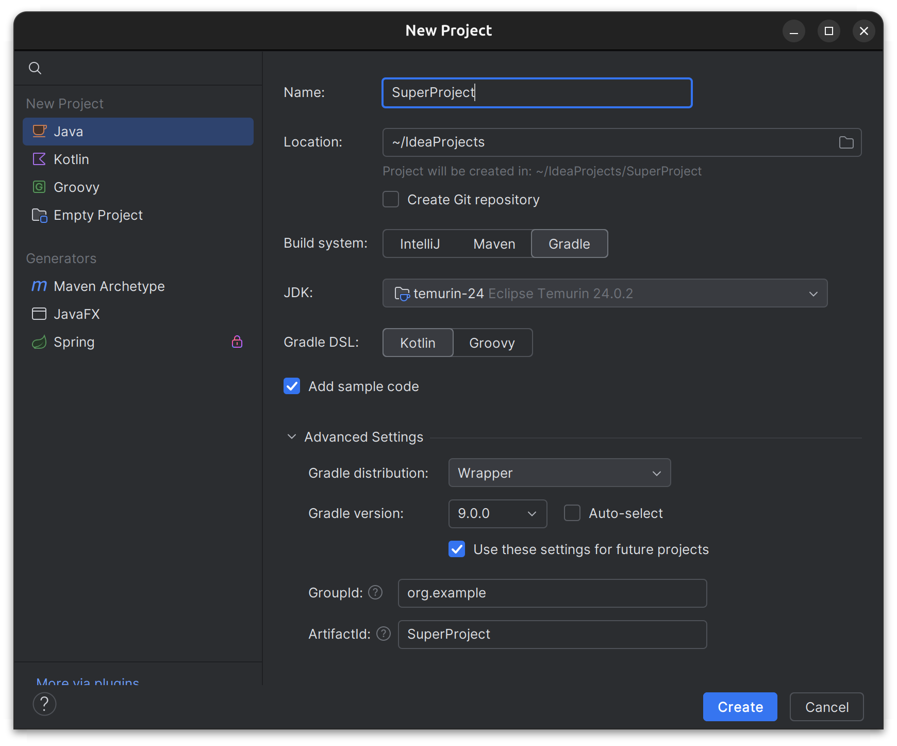
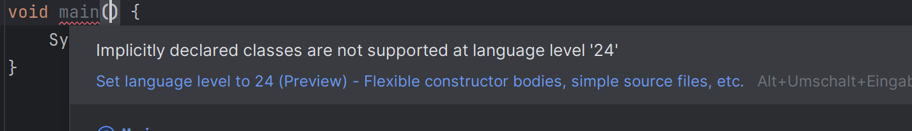
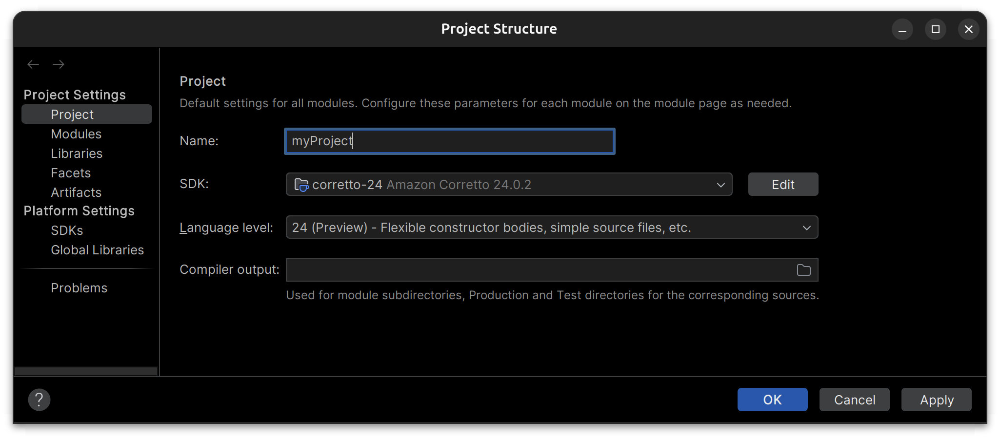

Um alle Features, die hier erklärt werden, nutzen zu können musst du die JDK 24 und Maven nutzen.

{ width=100% }

Außerdem musst du die `Preview-Features` aktivieren. Dies geht am einfachsten, wenn du ein Preview-Feature verwendest. 

Vor Version 24 musste man in Java eine `Main`-Klasse mit `main`-Methode schreiben.
Z.B.

```{.java}
public class HelloWorld {
    public static void main(String[] args) {
        System.out.println("Hello, World!");
    }
}
```

Ab Java 24 reicht eine einfache `main`-Funktion aus.

```{.java}
void main() {
    System.out.println("Hello, World!");
}
```


Beim hovern über diese Funktion wird dir vorgeschlagen, die `Preview-Features` zu aktivieren. Dies geht einfach per Klick auf den blauen Text.

{ width=100% }


# Projekteinstellungen ändern
Wenn die Projekteinstellungen nicht mehr wie oben gesetzt sind, kannst du auf `File` und `Project Structure` klicken und die Einstellungen wieder korrigieren.

{ width=100% }


# Variablen

## Mit Typangabe

Beim Initialisieren einer Variable steht der Typ vor der Variablen. 

```{.java .cb-nb first_number=1}
int a = 2;
a = a + 1;
a;
```

## Ohne Typangabe

Auf die Typangabe kann auch verzichtet werden, wenn stattdessen das Schlüsselwort `var` genutzt wird. 


```{.java .cb-nb first_number=1}
var b = true;
b && false;
```


# Primitive und nicht primitive Typen
In Java gibt es neben den primitiven Typen wie `int` und `boolean` entsprechende Klassen wie `Integer` und `Boolean`.

```{.java .cb-nb first_number=1}
Integer c = 5;
```

| primitiven Typen    | Klasse |
| -------- | ------- |
| `int`  | `Integer` |
| `boolan` |  `Boolean`     |
| `char`    | `Character`    |
| `float`    | `Float`    |
| `double`    | `Double`    |
|     | `String`    |


Im Gegensatz zu den primitiven Datentypen können wir auf Objekten dieser Klassen Methoden nutzen.

```{.java .cb-nb first_number=1}
String d = c.toString();
```

Der Vergleich mit `==` prüft bei primitiven Typen, ob zwei Werte inhaltlich gleich sind.

```{.java .cb-nb first_number=1}
int e = 3;
int f = 3;
e == f;
```

Bei Objekten wird mit `==` geprüft, ob es sich um dasselbe Objekt handelt.

```{.java .cb-nb first_number=1}
Integer g = 150;
Integer h = 150;
g == h;
```

Objekte können mit der `equals` Methode auf inhaltliche Gleichheit geprüft werden.

```{.java .cb-nb first_number=1}
g.equals(h);
```

Primitive Datentypen und die entsprechenden Klassen werden automatisch konvertiert.
```{.java .cb-nb first_number=1}
Integer i = 5;
int j = i;
j;
```

Im Gegensatz zu primitiven Typen können Werte von Klassen immer `null` sein.
```{.java .cb-nb first_number=1}
Integer noInt = null;
```

# Ausgabe an der Konsole

Die Ausgabe an der Konsole erfolgt mit `System.out.println`.

```{.java .cb-nb first_number=1}
System.out.println("hello");
```

# Funktionen

Bei der Definition von Funktionen beginnt man mit dem Rückgabetyp. Ein Schlüsselwort für die Definition von Funktionen gibt es nicht.
Die Typen der Parameter stehen vor dem Parameternamen.

```{.java .cb-nb first_number=1}
int square(int x){
  return x * x;
}
```

```{.java .cb-nb first_number=1}
square(3);
```

Wenn nichts zurückgegeben wird, schreibt man `void` statt eines Rückgabetyps.

```{.java .cb-nb first_number=1}
void printSquare(int x){
  System.out.println(x * x);
}

printSquare(5);
```


# Fallunterscheidungen
## Zweiseitig
`if` - `else` funktioniert wie in Kotlin, kann aber nicht als Ausdruck genutzt werden.


## Mehrseitig


Um einen Wert  mit mehreren Möglichkeiten zu vergleichen verwendet man in Java das Schlüsselwort `switch`.

Es gibt `switch`-Ausdrücke

```{.java .cb-nb first_number=1}
var k = 2;

var l = switch(k) {
  case 1 ->  "One";
  case 2 ->  "Two";
  default -> "Big Number"; 
};

l;
```

Der Wert des gesamten Ausdrucks ist der Wert des Ausdrucks, der rechts von dem Wert steht, mit dem der Ausdruck in Klammern übereinstimmt.

Es gibt auch `switch`-Statements.


```{.java .cb-nb first_number=1}
var m = 3;
var result = "";

switch(m) {
  case 1 -> result = "One";
  case 2 ->  result = "Two";
  default -> result = "Big Number"; 
};

result;
```
Hier wird der Code ausgeführt, der rechts von dem Wert steht, mit dem der Ausdruck in Klammern übereinstimmt.


# While-Schleifen

Bei einer `while`-Schleife muss man in der Regel 

- eine Variable initialisieren
- prüfen, ob der Schleifenkörper nochmal ausgeführt werden soll
- den Wert der Variablen ändern


```{.java .cb-nb first_number=1}
var n = 1;
while (n < 10){
  System.out.println(n);
  n = n * 2;
}
```

# For-Schleifen

Bei einer `for`-Schleife benötigen wir in Java dieselben Bestandteile.
Hier steht aber alles im Schleifenkopf.

```{.java .cb-nb first_number=1}
for (var o = 1; o < 10; o = o * 2){
  System.out.println(o);
}
```

`for`- Schleifen werden oft genutzt, um in Einer-Schritten hochzuzählen. 

```{.java .cb-nb first_number=1}
for (var p = 1; p < 4; p++){
  System.out.println(p);
}
```

# Unveränderliche Objekte

## Definition der Klasse und Erzeugung von Objekten 

Mit dem Schlüsselwort `record` können relativ einfach Klassen mit unveränderlichen Eigenschaften erzeugt werden.

```{.java .cb-nb first_number=1}
record Student(String name, int age){};
```

Vor jedem Aufruf des Konstruktors muss `new` stehen.

```{.java .cb-nb first_number=1}
var alex = new Student("Alex", 18);
```

## Zugriff auf Eigenschaften 


Auf die Eigenschaften von `Records` kann nicht direkt von außen zugegriffen werden.
Um den Zugriff zu ermöglichen, werden aber automatisch Methoden definiert, die genau wie die Eigenschaften heißen.

```{.java .cb-nb first_number=1}
alex.age();
```

## Methoden 


Methoden werden zwischen geschweiften Klammern definiert.

```{.java .cb-nb first_number=1}
record SpeakingStudent(String name, int age){

  String generateGreeting(){
    return "I am " + name + " and I am " + age + " years old!";
  }

};
```

```{.java .cb-nb first_number=1}
var speakingStudent = new SpeakingStudent("Alex", 18);
speakingStudent.generateGreeting()
```


## Sekundäre Konstruktoren 

Im Klassenkörper können auch sekundäre Konstruktoren definiert werden.

Die Definition beginnt mit dem Namen der Klasse. Anschließend folgen in runden Klammern die Parameter des Konstruktors.
In den geschweiften Klammern wird mit `this` der primäre Konstruktor aufgerufen.

```{.java .cb-nb first_number=1}
record Student(String name, int age){
    
    Student(String name){
      this(name, 14);
    }

};
```


```{.java .cb-nb first_number=1}
var nino = new Student("Nino");
nino.age();
```


# Listen

## Unveränderliche Listen
Listen müssen zunächst importiert werden.

```{.java .cb-nb first_number=1}
import java.util.List;
```


Mit `List.of` kann ein Element vom Typ `List` erzeugt werden.
```{.java .cb-nb first_number=1}
var xs = List.of(1, 3, 5);
```

Mit einer `for`-Schleife können die Elemente in einer Liste durchlaufen werden.

```{.java .cb-nb first_number=1}
for (var x : xs){
  System.out.println(x);
}
```

Mit der Methode `get` kann auf Elemente in einer Liste zugegriffen werden.
```{.java .cb-nb first_number=1}
xs.get(1);
```


Mit der Methode `size` kann die Anzahl der Elemente in einer Liste bestimmt werden.
```{.java .cb-nb first_number=1}
xs.size();
```


## Veränderliche Listen

Objekte der Klasse `ArrayList` sind veränderliche Listen. 

```{.java .cb-nb first_number=1}
import java.util.ArrayList;
```
Wenn dem Konstruktor nichts übergeben wird, wird eine leere Liste erzeugt. In diesem Fall muss der Typ in eckigen Klammern angegeben werden. Für den Typ der Elemente einer Liste können wir keinen primitiven Typ wählen.


```{.java .cb-nb first_number=1}
var ys = new ArrayList<Integer>();
ys;
```

Es kann aber auch eine Liste übergeben werden.

```{.java .cb-nb first_number=1}
var zs = new ArrayList<>(List.of(1, 3, 5));
zs;
```

Auf einer `ArrayList` kann man die Methode `add` aufrufen, die ein Element anhängt.

```{.java .cb-nb first_number=1}
zs.add(7);
zs;
```


Mit der Methode `set` kann man das Element an einer gewünschten Stelle ersetzen.

```{.java .cb-nb first_number=1}
zs.set(2, 10);
zs;
```

## Array-Listen als Listen verwenden

Immer wenn der Compiler einen Wert vom Typ `List` erwartet, können wir auch eine `ArrayList` übergeben.
```{.java .cb-nb first_number=1}
List<Integer> firstTwo(List<Integer> xs){
  var ys = new ArrayList<Integer>();
  ys.add(xs.get(0));
  ys.add(xs.get(1));
  return ys;
}

var emptyArrayList = new ArrayList<>(List.of(1, 3, 5));
firstTwo(emptyArrayList);
```


# Typparameter

Typparameter werden vor dem Rückgabetyp definiert.
```{.java .cb-nb first_number=1}
<T> T firstElem(List<T> xs){
  return xs.get(0);
}
```
<!-- 
# Klassen mit veränderlichen Eigenschaften

Klassen mit veränderlichen Eigenschaften können in Java mit dem Schlüsselwort `class` definiert werden.
Alle Eigenschaften werden im Klassenkörper definiert.

```{.java .cb-nb first_number=1}
class MutableStudent{
  String name;
  int age;

  public MutableStudent(String name, int age){
    this.name = name;
    this.age = age;
  }

}
```

Der Konstruktor muss selbst geschrieben werden. Wenn die Argumente des Konstruktors dieselben Namen wie die Eigenschaften der Klasse haben,
muss mit `this.eigenschaft` auf eine Eigenschaft zugegriffen werden.


```{.java .cb-nb first_number=1}
var pana = new MutableStudent("Pana", 17);
```

Methoden können wie bei Records definiert werden.


```{.java .cb-nb first_number=1}
class MutableStudent{
  String name;
  int age;

  MutableStudent(String name, int age){
    this.name = name;
    this.age = age;
  }

  void getOlder(){
    age = age + 1;
  }

}
```


```{.java .cb-nb first_number=1}
var luca = new MutableStudent("Luca", 18);
luca.getOlder();
luca.age;
```

In der Regel werden veränderliche Eigenschaften als `private` und Konstruktoren sowie Methoden als `public` deklariert. 
Um trotzdem auf Eigenschaften zuzugreifen, werden Methoden definiert, die den Wert einer Eigenschaft zurückgeben.

```{.java .cb-nb first_number=1}
class MutableStudent{
  private String name;
  private int age;

  public MutableStudent(String name, int age){
    this.name = name;
    this.age = age;
  }

  public void getOlder(){
    age = age + 1;
  }

  public String getName(){
    return name;
  }

  public int getAge(){
    return age;
  }

}
``` -->
<!-- 

```{.java .cb-nb first_number=1}
var micha = new MutableStudent("Micha", 18);
micha.getOlder();
micha.getAge();
```

Auch zum Setzen von Eigenschaften werden Methoden definiert. 
In diesen sollte ein Fehler geworfen werden, wenn ein invalider Wert gestzt werden soll. 


```{.java .cb-nb first_number=1}
class MutableStudent{
  private String name;
  private int age;

  public MutableStudent(String name, int age){

    if (age < 0){
      throw new IllegalArgumentException("age must be positive");
    }

    this.name = name;
    this.age = age;
  }

  public void getOlder(){
    age = age + 1;
  }

  public String getName(){
    return name;
  }

  public int getAge(){
    return age;
  }

  public void setAge(){
    if (age < 0){
      throw new IllegalArgumentException("age must be positive");
    }

    this.age = age;
  }

}
``` -->
