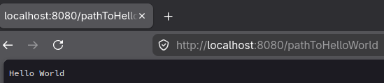

```{.java .cb-run}
%%loadFromPOM
<dependency>
    <groupId>io.javalin</groupId>
    <artifactId>javalin</artifactId>
    <version>7.1.0</version>
</dependency>
    <dependency>
        <groupId>org.slf4j</groupId>
        <artifactId>slf4j-simple</artifactId>
        <version>2.0.17</version>
</dependency>
```


# Javalin-Framework

## Grundlagen und Abhängigkeiten laden

Mit dem Framework `Javalin` können wir HTTP-Anfragen verarbeiten und beantworten.
Dafür ergänzen wir in der Datei `build.gradle` die folgenden Abhängigkeiten.


\begingroup
\tiny
```java
implementation("io.javalin:javalin:7.1.0")
implementation("org.slf4j:slf4j-simple:2.0.17")
```
\endgroup

Wenn du Maven verwendest, trägst du stattdessen diese Abhängigkeiten ein:

\begingroup
\tiny
```xml
<dependencies>
    <dependency>
        <groupId>io.javalin</groupId>
        <artifactId>javalin</artifactId>
        <version>7.1.0</version>
    </dependency>
    <dependency>
        <groupId>org.slf4j</groupId>
        <artifactId>slf4j-simple</artifactId>
        <version>2.0.17</version>
    </dependency>
</dependencies>
```
\endgroup


## App erstellen und starten

Jetzt können wir in der `main`-Methode mit der statischen Methode `create` ein Objekt der Klasse `Javalin` erzeugen.
Dieses Objekt repräsentiert unsere Server-Anwendung.


```java
Javalin app = Javalin.create();
```
Mit der Methode `start` starten wir die App.


```java
app.start();
```


Zunächst läuft die Anwendung auf dem lokalen Rechner. Dieser ist unter dem Hostnamen `localhost` erreichbar.
Javalin verwendet standardmäßig Port $8080$.
Wir erreichen unsere Anwendung also unter `http://localhost:8080/`.

 { width=50% }

Die Fehlermeldung zeigt: Der Server weiß noch nicht, wie er Anfragen an diese Adresse beantworten soll.
Genau das ergänzen wir im nächsten Schritt.

## Methoden zur Behandlung von HTTP-Anfragen definieren


Im ersten Schritt definieren wir eine Methode, die Anfragen beantwortet.
Dafür legen wir in einer neuen Klasse eine Methode mit einem Parameter vom Typ `Context` an.

```{.java .cb-nb line_numbers=false}
import io.javalin.http.Context;

class Controller {
    public void respondHelloWorld(Context ctx){
        ctx.result("Hello World");
    }
}
```

Der `Context` enthält alle Informationen und Methoden, die wir zum Beantworten einer Anfrage brauchen.
In diesem Beispiel verwenden wir nur die Methode `result`. Sie sendet den übergebenen String als Antwort.


## Routen in Javalin konfigurieren


Als Nächstes implementieren wir eine Methode, die unsere Javalin-Anwendung konfiguriert.
Dabei fügen wir *Routen* zu unserer Anwendung hinzu.
Eine *Route* ist die Zuordnung aus HTTP-Methode (z. B. GET oder POST), Pfad und Java-Methode, die die Anfrage bearbeitet.


Dafür definieren wir in einer weiteren Klasse `JavalinConfigurator` die statische Methode `configure` mit einem Parameter vom Typ `JavalinConfig`.


 
```{.java .cb-nb line_numbers=false}
import io.javalin.config.JavalinConfig;
import io.javalin.config.RoutesConfig;

public class JavalinConfigurator {

    public static void configure(JavalinConfig config) {
        var controller = new Controller();
        RoutesConfig routes = config.routes;
        routes.get("/pathToHelloWorld", controller::respondHelloWorld);
    }
}
```

Diese Methode erzeugt einen Controller und ein Objekt `routes` vom Typ `RoutesConfig`.
`RoutesConfig` stellt unter anderem die Methode `get` bereit.
An `get` übergeben wir einen Pfad und eine Methode, die GET-Anfragen für diesen Pfad beantworten soll.
In diesem Beispiel wird jede HTTP-GET-Anfrage an `/pathToHelloWorld`
mit `respondHelloWorld` des Objekts `controller` beantwortet.
Die Schreibweise `controller::respondHelloWorld` verweist nur auf die Methode. Sie wird an dieser Stelle nicht ausgeführt.


Jetzt können wir in der `main`-Methode beim Erzeugen der `Javalin`-App die Methode `JavalinConfigurator::configure` übergeben.

```java
Javalin app = Javalin.create(JavalinConfigurator::configure);
app.start();
```

Unser Server ist unter `http://localhost:8080` erreichbar, und die eben definierte Methode beantwortet Anfragen an den relativen Pfad `/pathToHelloWorld`.
Die vollständige URL zum Testen lautet daher `http://localhost:8080/pathToHelloWorld`.


 { width=50% }

## Content-Type für Antworten definieren

Natürlich können wir dem Client auch `HTML`-Code schicken.

```java
// in Controller.java
ctx.result("<h1>Hello World</h1>");
```

Dieser wird zunächst als gewöhnlicher Text angezeigt:


```
<h1>Hello World</h1>
```

Damit der HTML-Code korrekt gerendert wird, müssen wir den Content-Type-Header der Antwort auf `text/html` setzen.
Das geht mit der `Context`-Methode `contentType`.

```java
// in Controller.java
ctx.contentType("text/html");
ctx.result("<h1>Hello World</h1>");
```

{ width=50% }


## Informationen über die Anfrage erhalten

Die Methode `respondHelloWorld` beantwortet aktuell alle HTTP-Anfragen auf dieselbe Weise.
Das muss natürlich nicht so bleiben.
Die Klasse `Context` bietet mehrere Methoden, mit denen wir Details zur HTTP-Anfrage auslesen können.

### Query-Parameter

Mit der Methode `queryParam` können wir den Wert eines bestimmten Query-Parameters auslesen.


```java
// in Controller.java
public void greetUser(Context ctx){
    String userName = ctx.queryParam("userName");
    ctx.result("Hello " + userName);
}
// in JavalinConfigurator.configure
routes.get("/getGreeting", controller::greetUser);
```

Beim Aufruf von
```
http://localhost:8080/getGreeting?userName=Nino
```

wird `Hello Nino` angezeigt.


### Path-Parameter

Mit der Methode `pathParam` können wir Teile des Pfads auslesen.

```{.java .cb-nb line_numbers=false}
public void greetUserPathParam(Context ctx){
    String userName = ctx.pathParam("userName");
    ctx.result("Hello " + userName);
}
```

Im Pfad verwenden wir jetzt einen Parameter `userName`.
Solche `Path-Parameter` werden mit geschweiften Klammern markiert.
 
```java
// in JavalinConfigurator.configure
routes.get("/{userName}/getGreeting", controller::greetUserPathParam);
```

Beim Aufruf von `http://localhost:8080/Pana/getGreeting` wird `Hello Pana` angezeigt.


### Form-Parameter

Das folgende Formular sendet die Eingabe als POST-Request an die relative Adresse `/getGreeting`:

```html
<form action="/getGreeting" method="post" >
    <input type="text"   name="userName" value="" />
    <button type="submit" >Absenden</button>
</form>
```
Der eingegebene Benutzername wird nicht in der `URL`, sondern im `Request-Body` der Anfrage übertragen.
Wenn der Name `Frieda` eingegeben wird, enthält der `Request-Body` den Eintrag `userName=Frieda`.

Daten, die über den POST-Request eines Formulars übermittelt werden, lesen wir mit der Methode `formParam` aus.


```java
// in Controller.java
public void greetUserFormParam(Context ctx){
    String userName = ctx.formParam("userName");
    ctx.result("Hello " + userName);
}

// in JavalinConfigurator.configure
routes.post("/getGreeting", controller::greetUserFormParam);
```

Da wir mit dieser Methode POST-Anfragen beantworten, nutzen wir in der Routen-Definition die Methode `post`.


### Header-Informationen abfragen


Die Header-Felder einer HTTP-Anfrage können mit der `Context`-Methode `header` ausgelesen werden.


```java
String acceptHeader = ctx.header("Accept");
``` 


## Webjars nutzen

Webjars sind Frontend-Bibliotheken, die wir in JVM-Programmen nutzen können.
Damit Webjars in Javalin-Anwendungen verfügbar sind, rufen wir in der Methode `JavalinConfigurator.configure` auf der Eigenschaft `staticFiles` des Parameters `config` die Methode `enableWebjars` auf.

```java
// in JavalinConfigurator.configure
config.staticFiles.enableWebjars();
```
