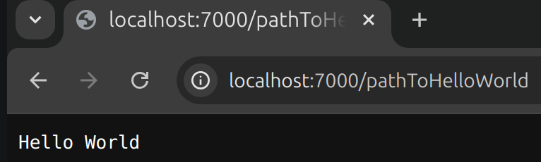
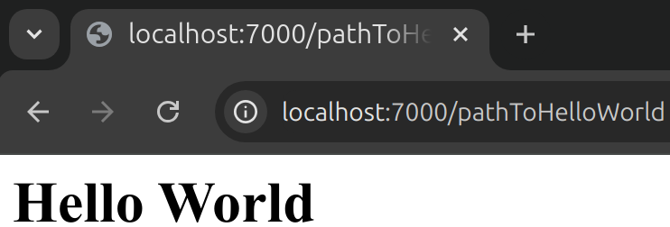

```{.java .cb-run}
%%loadFromPOM
<dependency>
    <groupId>io.javalin</groupId>
    <artifactId>javalin</artifactId>
    <version>6.7.0</version>
</dependency>
```


# Javalin-Framework

## App erstellen und starten

Das Framework `Javalin` ermöglicht es uns HTTP-Anfragen zu beantworten.
Um es zu nutzen, müssen wir die folgende Abhängigkeit in der Datei `build.gradle` ergänzen.


```java
implementation("io.javalin:javalin:6.7.0")
```


Anschließend importieren wir die Klasse `Javalin` in der Datei, in der wir eine `Javalin`-Anwendung definieren wollen.

```
import io.javalin.Javalin;
```

Nun können wir mit dem folgenden Code eine Anwendung erzeugen und starten.

```java
Javalin app = Javalin.create();
app.start(7000);
```

Diese warten auf Anfragen an dem Port $7000$.

## Behandlung von HTTP-Abfragen definieren


Im nächsten Schritt müssen wir definieren, wie wir Abfragen beantworten wollen.
Dafür definieren wir in einer neuen Klasse eine Methode, die einen Parameter vom Typ `Context` hat.

```java
import io.javalin.http.Context;

class Controller {
    public void respondHelloWorld(Context ctx){
        ctx.result("Hello World");
    }
}
```

Der `Context` enthält alle Informationen und Methoden, die notwendig sind um Abfragen zu beantworten.
In diesem Beispiel wird nur die Methode `result` genutzt. Diese schickt den übergeben String als Antwort auf eine Anfrage.


Jetzt können wir nach dem Erzeugen und Starten der `Javalin`-App den Controller erzeugen und die `Javalin` Methode `get` aufrufen.
Dieser wird ein Pfad und eine Methode, die GET-Anfrage an diesen Pfad beantworten soll, übergeben. 

Die Syntax `controller::respondHelloWorld` sorg dafür, dass die Methode `respondHelloWorld` an die Methode `get` übergeben wird. Sie wird nicht aufgerufen.

```java
Javalin app = Javalin.create();
app.start(7000);
var controller = new Controller();
app.get("/pathToHelloWorld", controller::respondHelloWorld);
```

Es wird also jede HTTP-GET-Anfrage an die Adresse des Servers, dem Pfad `/pathToHelloWorld` und dem Port $7000$ 
 mit der Methode `respondHelloWorld` beantwortet. 


Zunächst läuft die Anwendung auf dem lokalen Server. Dieser hat den Domainnamen `localhost`. 
Wir erreichen unsere Anwendung also unter: `http://localhost:7000/pathToHelloWorld`
 

 { width=50% }

## Content-Type für Antworten definieren

Natürlich können wir dem Client auch `HTML`-Code schicken.

```java
// in Controller.java
ctx.result("<h1> Hello World <h1>");
```

Dieser wird zunächst als Code angezeigt


```
<h1> Hello World <h1>
```

Um zu erreichen, dass dieser korrekt gerendert wird, müssen wir den Accept-Header unserer Antwort auf `text/html` setzen.
Dies ist mit der `Context`-Methode `contentType` möglich.

```java
// in Controller.java
ctx.contentType("text/html")
ctx.result("<h1> Hello World <h1>");
```

{ width=50% }


# Informationen über die Abfrage erhalten

Die Methode `respondHelloWorld` beantwortet alle HTTP-Abfragen gleich. 
Das muss natürlich nicht so sein.
Die Klasse `Context` stellt einige Methoden bereit, um Details über die HTTP-Abfrage zu erhalten.

## Query-Parameter

Mit der Methode `queryParam` können wir den Wert zu einem bestimmten Query-Parameter abfragen.


```java
// in Controller.java
public void greetUser(Context ctx){
    String userName = ctx.queryParam("userName");
    ctx.result("Hello " + userName);
}
// nach Erstellung der Javalin-App
app.get("/getGreeting", controller::respondHelloWorld);
```

Beim Aufruf von
```
http://localhost:7000/geetGreeting?userName=Nino
```

wird `Hallo Nino` angezeigt.


## 

Mithilfe der Methode `pathParam` können Teile des Pfads abgefragt werden.

```java
public void greetUserPathParam(Context ctx){
    String userName = ctx.pathParam("userName");
    ctx.result("Hello " + userName);
}
```

Im Pfad müssen wir jetzt einen Parameter `userName` verwenden. Solche `Path-Paramteter` werden mit geschweiften Klammern gekennzeichnet.
 
```java
app.get("/{userName}/geetGreeting/", controller::greetUserPathParam);
```

Beim Aufruf von `http://localhost:7000/Pana/geetGreeting` wird `Hello Pana` angezeigt.


## Form-Parameter

Das folgende Formular verschickt die Eingabe als Post-Request an die relative Adresse `getGreeting`. 

```html
<form action="/getGreeting" method="post" >
    <input type="text"   name="userName" value="" />
    <button type="submit" > Submit  </button>
</form>
```
Der eingegebene Benutzername wird nicht in der `URL` übermittelt, sondern im `RequestBody` der Abfrage.
Bei der Eingabe des Namens `Frieda` steht, im `RequestBody` `userName=Frieda`.

Daten, die über eine Post-Abfrage eines Formulars übermittelt wurden, können mit der Methode `formParam` abgefragt werden.


```java
// in Controller.java

public void greetUserPathParam(Context ctx){
    String userName = ctx.formParam("userName");
    ctx.result("Hello " + userName);
}

// nach Erstellung der Javalin-App
app.post("/getGreeting", controller::greetUserPathParam);
```

Da wir mit dieser Abfrage Post-Abfragen beantworten, müssen wir die Methode `post` nutzen.


## Header-Informationen abfragen


Die Header einer HTTP-Abfrage können mit der `Context`-Methode `header` abgefragt werden.


```java
String acceptsHeader = ctx.header("Accept");
``` 


# Webjars nutzen

Webjars sind Frontend-Bibliotheken, die man in JVM-Programmen nutzen kann. 
Um Webjars in Javalin-Anwendungen nutzen zu können müssen wir zunächst eine statische Methode definieren, die diese Einstellungen vornimmt. 

```java
// In Utils.java
public class Utils {
    public static void configureJavalin(JavalinConfig javalinConfig) {
        javalinConfig.staticFiles.enableWebjars();
    }
}
```
Diese wird beim Erzeugen des `Javalin`-Objekts übergeben.
```java
// In der main
var app =  Javalin.create(Utils::configureJavalin);
```

